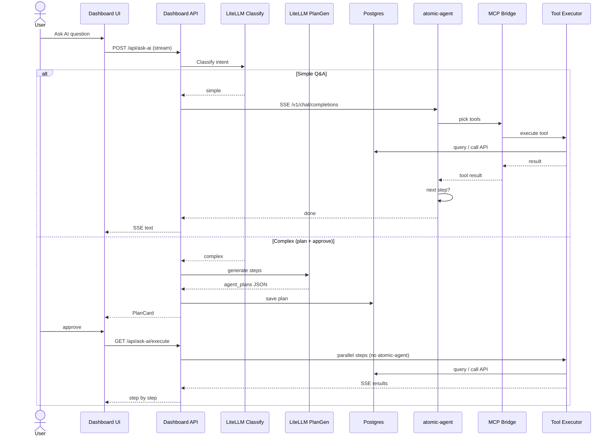
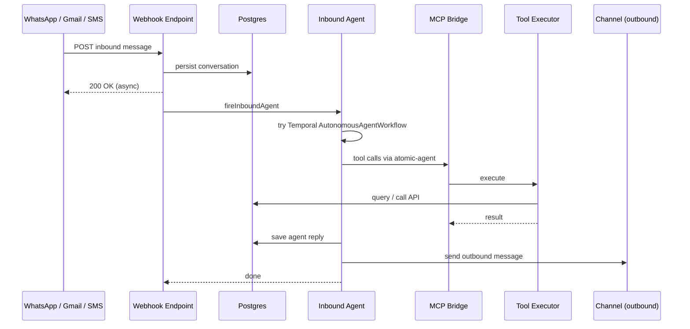

# 01 — System overview

Darex (“brain of the organization”) is a **multi-tenant AI-employee platform**.
Each signed-in user gets their own org. AI employees (Sarah / Emma / Marcus by
default) answer questions and run tools on that org’s connected apps.

Runtime is **not** LangGraph or Hermes. The live loop is:

**atomic-agent (v0.1.72)** → **MCP bridge** (`mcp.darex.*`) → **`tool-executor.ts`**
→ real provider APIs / Postgres / Jina / sandbox.

## System architecture

```mermaid
graph TB
    subgraph Client[“Client Layer”]
        UI[“Dashboard UI<br/>(Next.js 14)”]
        Widget[“Chat Widget<br/>(Embed)”]
    end

    subgraph Auth[“Auth & Session”]
        ST[“SuperTokens :3567”]
        PG_Auth[“Postgres Auth<br/>(fallback)”]
    end

    subgraph API[“API Layer”]
        Dashboard[“Dashboard API<br/>(Next.js routes)”]
        Classify[“Classifier<br/>(LiteLLM)”]
        PlanGen[“Plan Generator<br/>(LiteLLM)”]
    end

    subgraph Agent[“Agent Runtime”]
        AtomicAgent[“atomic-agent v0.1.72<br/>:8787 SSE”]
        MCP[“MCP Bridge<br/>:8790 (62 tools)”]
        Executor[“Tool Executor<br/>(tool-executor.ts)”]
    end

    subgraph Temporal[“Durable Workflows”]
        TA[“AutonomousAgentWorkflow<br/>(up to 3 turns)”]
        Crew[“CrewWorkflow<br/>(3 child agents)”]
        WorkItem[“WorkItemWorkflow”]
        RAG[“RAG Ingest/Retrieve”]
    end

    subgraph Connectors[“Provider Integrations”]
        Nango[“Nango OAuth Vault<br/>:3003”]
        Gmail[“Gmail<br/>(Nango)”]
        GSheets[“Google Sheets<br/>(Nango)”]
        GDrive[“Google Drive<br/>(Nango)”]
        Zoho[“Zoho CRM<br/>(Nango)”]
        QBO[“QuickBooks<br/>(Nango)”]
        Meta[“Meta Ads / WhatsApp<br/>(API)”]
    end

    subgraph Inbound[“Inbound Channels”]
        WA[“WhatsApp Webhook”]
        Gmail_In[“Gmail Inbound”]
        Chatwoot[“Chatwoot Webhook”]
        SMS[“SMS Inbound”]
        Inbox_GW[“Inbox Gateway :3004<br/>(HMAC)”]
    end

    subgraph DB[“Data Layer”]
        Postgres[“Postgres 16 + pgvector<br/>:5432 RLS”]
        Redis[“Redis<br/>(sessions, rate limit)”]
        PGVec[“pgvector<br/>(org memory)”]
    end

    subgraph Observability[“Observability”]
        Langfuse[“Langfuse :3002<br/>(traces)”]
        ClickHouse[“ClickHouse<br/>(persistence)”]
    end

    subgraph Infra[“Infrastructure”]
        Compose[“docker-compose<br/>(14 services)”]
        Sandbox[“Sandbox Container<br/>(code execution)”]
    end

    UI --> Dashboard
    Widget --> Dashboard
    Dashboard --> ST
    Dashboard --> PG_Auth
    Dashboard --> Classify
    Dashboard --> PlanGen
    Classify --> AtomicAgent
    PlanGen --> Dashboard
    AtomicAgent --> MCP
    MCP --> Executor
    Dashboard --> TA
    Dashboard --> Crew
    Executor --> Nango
    Executor --> Postgres
    Executor --> Sandbox
    Nango --> Gmail
    Nango --> GSheets
    Nango --> GDrive
    Nango --> Zoho
    Nango --> QBO
    Executor --> Meta
    WA --> Inbox_GW
    Gmail_In --> Inbox_GW
    Chatwoot --> Inbox_GW
    SMS --> Inbox_GW
    Inbox_GW --> Dashboard
    Dashboard --> TA
    TA --> Executor
    Crew --> Executor
    Postgres --> Redis
    Postgres --> PGVec
    Dashboard --> Langfuse
    Executor --> Langfuse
    Langfuse --> ClickHouse
    Compose -.-> Postgres
    Compose -.-> Redis
    Compose -.-> AtomicAgent
```

## Monorepo structure

pnpm workspaces + Turbo. Root `package.json` workspaces: `apps/*`, `services/*`,
`packages/*`.

```
Agentic-Os-SaaS/
├── apps/dashboard              @darex/dashboard   Next.js 14 (UI + all API routes)
├── apps/inbox                  @darex/inbox       Express Chatwoot webhook proxy :3004
├── services/workflows          @darex/workflows   Temporal worker, MCP bridge, tool executor
├── services/connectors         @darex/connectors  Nango SDK wrappers (test proxy only)
├── packages/shared-types       placeholder README only
├── infra/
│   ├── docker-compose.yml      14 services
│   ├── docker/                 Dockerfiles (atomic-agent, bridge, sandbox)
│   ├── migrations/             14 SQL migrations (Postgres + pgvector)
│   └── scripts/                LiteLLM, Redis, compose startup
└── docs/current-working/       Status + architecture docs
```

**Not in the tree:** `apps/agents/` (old LangGraph plan). Do not rebuild it.

## Ask AI execution flow



## Inbound message flow



## Runtime pieces (service registry)

| Piece | Package / service | Port | Job |
|-------|-------------------|------|-----|
| Dashboard UI | `apps/dashboard/app/(dashboard)` | :3000 | Pages: Home, Ask AI, Conversations, Employees, Listings, Billing |
| Dashboard API | `apps/dashboard/app/api` | :3000 | Auth, Ask AI, agents, webhooks, CRUD, OAuth callback |
| Classifier | `apps/dashboard/lib/classify.ts` | — | LiteLLM JSON (simple vs complex) |
| Plan generator | `apps/dashboard/lib/plan-generator.ts` | — | LiteLLM JSON steps + approval |
| LLM gateway | `darex-litellm` | :4000 | OpenRouter `deepseek-chat` |
| Agent loop | `darex-atomic-agent` | :8787 | Multi-step tool calling via MCP (SSE) |
| MCP bridge | `darex-atomic-bridge` | :8790 | 62 tools registry → `executeAutonomousToolAction` |
| Tool executor | `services/workflows/src/tool-executor.ts` | — | Real HTTP + Nango tokens + allowlist enforcement |
| Temporal server | `darex-temporal` | :7233 | Workflow orchestration + UI |
| Temporal worker | `darex-worker` | — | Runs workflows (AutonomousAgent, Crew, RAG, etc.) |
| Auth | SuperTokens | :3567 | Email + OAuth; Postgres fallback |
| OAuth vault | Nango | :3003 | Connection id `{orgId}_{provider}` |
| Traces | Langfuse | :3002 | Ask AI + plan + agent spans |
| DB | Postgres | :5432 | `darex` database, RLS on all tenant tables |
| Cache | Redis | :6379 | Sessions, rate limits, pub/sub |
| Inbox gateway | `darex-inbox` | :3004 | Chatwoot webhook proxy + HMAC signing |
| Sandbox | Docker container | via HTTP | Python / Node / Bash code execution |

## House rules encoded in code

1. **Tenancy:** never trust `org_id` from a request body. Resolve from session
   (`getScopedClient` → `users.org_id`) then `SET app.current_org_id`.
2. **Webhooks:** return 200 first; never await the LLM inline. Fire agent async via Temporal or fallback.
3. **Pool:** release the DB client before opening SSE / long LLM calls.
4. **Honesty:** missing OAuth → `connected: false` + `/connectors`, never fake data.
5. **Env-only secrets:** no hardcoded keys in shipped source. Per-org in `channels.meta`.
6. **atomic-agent drops `system` role** — org facts go in the **user** message
   (`buildGroundedUserMessage`). No grounding in system prompt.
7. **RBAC:** roles stored in `org_members.role`; check in API before sensitive mutations.
8. **Audit logs:** all CRUD via `recordAuditLog` in Postgres with `audit_logs` table.
9. **HITL:** inbound send/pay/sign gated on human approval before tools execute.

## What this is not

- Not a Chatwoot fork. `apps/inbox` is a thin Express proxy.
- Not Hermes / LangGraph. Those files were deleted.
- Not a full RAG product. `pgvector` enabled; embeddings pipeline pending.
- Not multi-instance. Realtime hub is in-memory in one Next.js process (Redis pub/sub wired but not active).
- Not real-time collaborative docs. No OT/CRDT layer; Postgres + polling.
