# 02 — Architecture diagrams

All diagrams are mermaid (render in GitHub / Cursor preview). They describe the
**current code** as of 2026-08-14, not the original spec. Each diagram shows a
specific architectural concern or data flow.

## 1. System context (14 services)

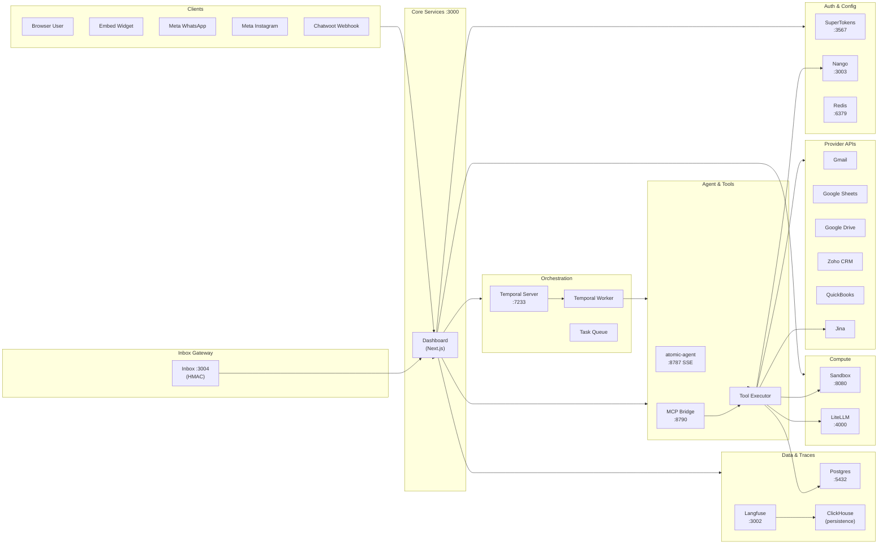

## 2. Monorepo architecture

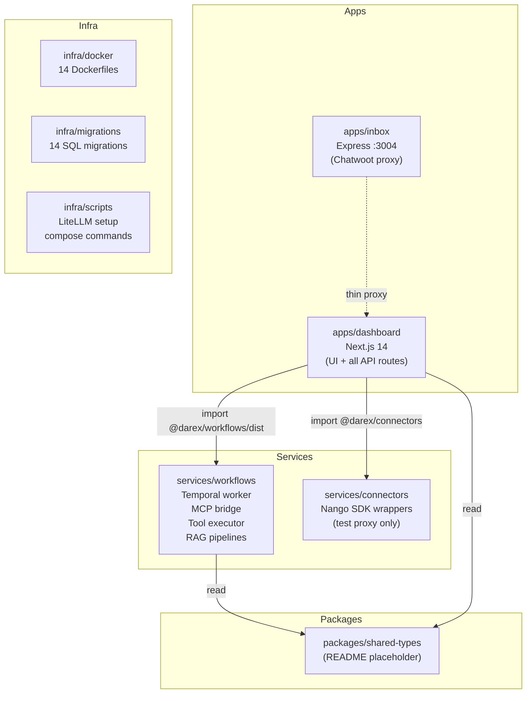

## 3. Ask AI execution (simple vs complex vs plan)

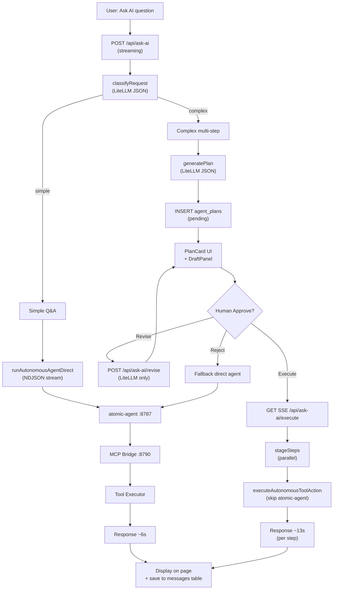

## 4. Authentication & tenancy (RLS)

```mermaid
sequenceDiagram
  participant User as Browser
  participant MW as middleware.ts
  participant API as Dashboard API
  participant DB as Postgres RLS
  participant Cache as Redis

  User->>MW: GET /dashboard (cookie)
  MW->>MW: extract darex_session cookie
  MW->>API: getScopedClient(userId)
  API->>DB: SELECT org_id FROM users WHERE id=$1
  DB-->>API: org_id
  API->>DB: BEGIN; SET app.current_org_id = $org_id
  DB->>Cache: SETEX org:{userId} 86400 {orgId}
  API-->>User: HTTP response (RLS active)
  Note over DB: All future queries filtered by<br/>app.current_org_id via RLS policy
  API->>DB: SELECT * FROM conversations<br/>(RLS: org_id = app.current_org_id)
  DB-->>API: only org's conversations
```

## 5. OAuth connection flow (Nango)

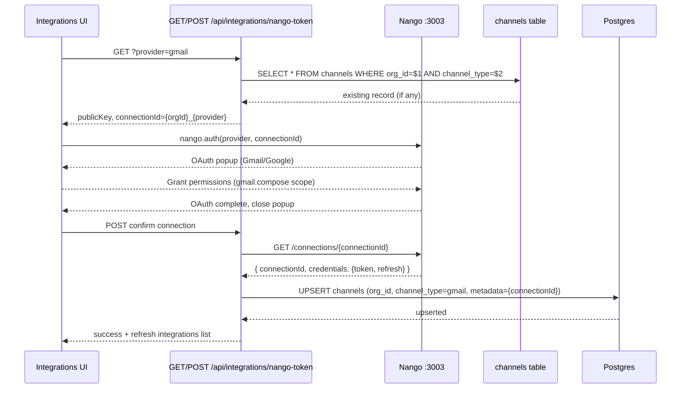

## 6. Inbound channels (all types)

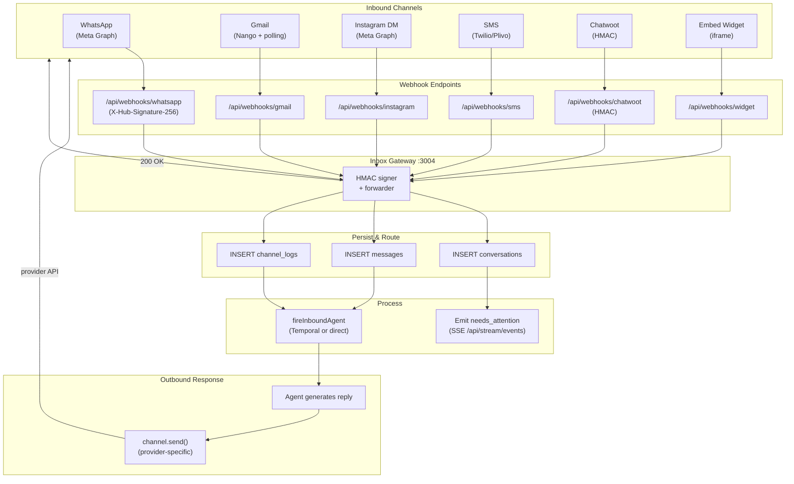

## 7. Tool execution with Nango & RLS

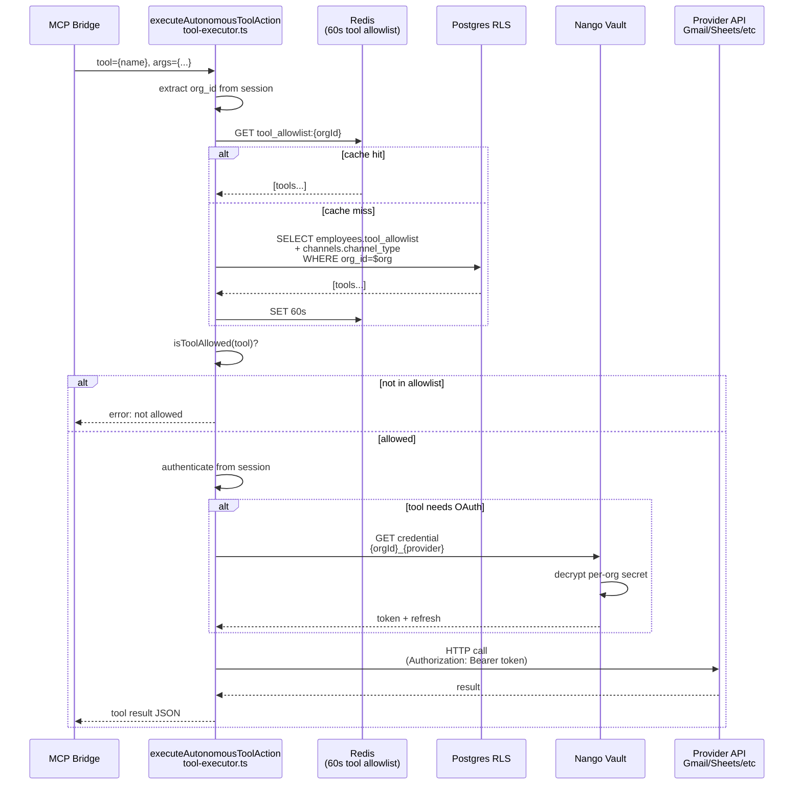

## 8. Temporal workflow orchestration

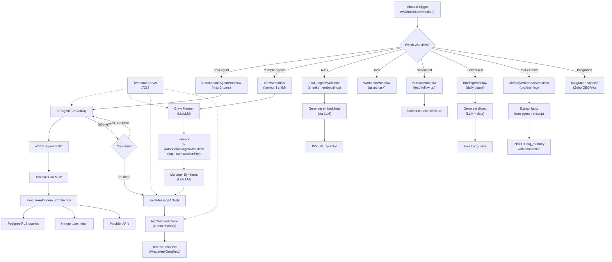

## 9. Tool allowlist resolution

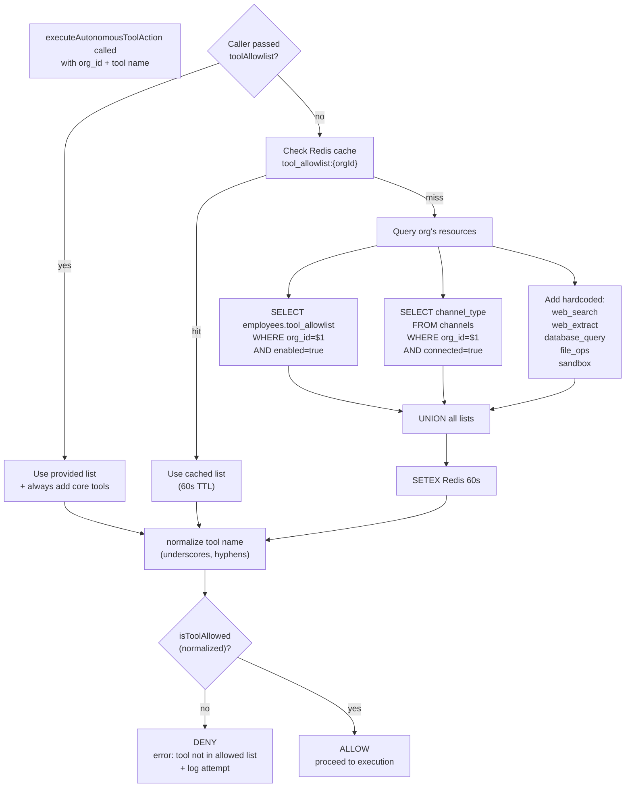

## 10. Complete database schema (tenant + system tables)

```mermaid
erDiagram
  ORGS ||--o{ USERS : contains
  ORGS ||--o{ ORG_MEMBERS : defines
  ORGS ||--o{ ORG_INVITES : generates
  ORGS ||--o{ CHANNELS : owns
  ORGS ||--o{ CONVERSATIONS : has
  ORGS ||--o{ MESSAGES : has
  ORGS ||--o{ AI_EMPLOYEES : has
  ORGS ||--o{ AGENT_PLANS : has
  ORGS ||--o{ CHANNEL_LOGS : tracks
  ORGS ||--o{ ORG_MEMORY : stores
  ORGS ||--o{ ORG_ONBOARDING : has
  ORGS ||--o{ LISTINGS : has
  ORGS ||--o{ SHOWINGS : schedules
  ORGS ||--o{ IDEMPOTENCY_KEYS : uses
  ORGS ||--o{ AUDIT_LOGS : tracks
  ORGS ||--o{ ORG_SUBSCRIPTIONS : has
  ORGS ||--o{ BILLING_METERS : tracks

  USERS ||--o{ ORG_MEMBERS : has_role
  CONVERSATIONS ||--o{ MESSAGES : contains
  AI_EMPLOYEES ||--o{ CONVERSATIONS : assigned
  CHANNELS ||--o{ CONVERSATIONS : sources
  LISTINGS ||--o{ SHOWINGS : has

  ORGS : int id PK
  ORGS : string name
  ORGS : string slug
  ORGS : jsonb metadata
  ORGS : timestamp created_at

  USERS : int id PK
  USERS : string email UK
  USERS : int org_id FK
  USERS : string password_hash
  USERS : string name

  ORG_MEMBERS : int id PK
  ORG_MEMBERS : int org_id FK
  ORG_MEMBERS : int user_id FK
  ORG_MEMBERS : string role
  ORG_MEMBERS : timestamp joined_at

  CHANNELS : int id PK
  CHANNELS : int org_id FK
  CHANNELS : string channel_type
  CHANNELS : jsonb metadata
  CHANNELS : boolean connected
  CHANNELS : timestamp connected_at

  CONVERSATIONS : int id PK
  CONVERSATIONS : int org_id FK
  CONVERSATIONS : int channel_id FK
  CONVERSATIONS : string external_id
  CONVERSATIONS : string participant_id
  CONVERSATIONS : string status
  CONVERSATIONS : timestamp created_at

  MESSAGES : int id PK
  MESSAGES : int org_id FK
  MESSAGES : int conversation_id FK
  MESSAGES : string role
  MESSAGES : text content
  MESSAGES : jsonb metadata
  MESSAGES : timestamp created_at

  AI_EMPLOYEES : int id PK
  AI_EMPLOYEES : int org_id FK
  AI_EMPLOYEES : string name
  AI_EMPLOYEES : string persona
  AI_EMPLOYEES : jsonb tool_allowlist
  AI_EMPLOYEES : boolean enabled

  AGENT_PLANS : int id PK
  AGENT_PLANS : int org_id FK
  AGENT_PLANS : int user_id FK
  AGENT_PLANS : jsonb steps
  AGENT_PLANS : string status
  AGENT_PLANS : timestamp created_at

  ORG_MEMORY : int id PK
  ORG_MEMORY : int org_id FK
  ORG_MEMORY : text content
  ORG_MEMORY : vector embedding
  ORG_MEMORY : float confidence
  ORG_MEMORY : timestamp created_at

  AUDIT_LOGS : int id PK
  AUDIT_LOGS : int org_id FK
  AUDIT_LOGS : int user_id FK
  AUDIT_LOGS : string action
  AUDIT_LOGS : jsonb changes
  AUDIT_LOGS : timestamp created_at

  LISTINGS : int id PK
  LISTINGS : int org_id FK
  LISTINGS : string address
  LISTINGS : string status
  LISTINGS : float price
  LISTINGS : timestamp created_at

  SHOWINGS : int id PK
  SHOWINGS : int org_id FK
  SHOWINGS : int listing_id FK
  SHOWINGS : timestamp scheduled_at
  SHOWINGS : string status
```

## 11. Docker network topology (14 services)

```mermaid
graph TB
  subgraph Host["Docker Host"]
    subgraph Net["docker-compose network (bridge)"]
      Dashboard["dashboard<br/>:3000"]
      Inbox["inbox<br/>:3004"]
      Langfuse["langfuse-server<br/>:3002"]
      Nango["nango<br/>:3003"]
      ST["supertokens<br/>:3567"]
      LLM["litellm<br/>:4000"]
      Postgres["postgres<br/>:5432"]
      Redis["redis<br/>:6379"]
      Temporal["temporal<br/>:7233"]
      TUI["temporal-ui<br/>:8233"]
      AA["atomic-agent<br/>:8787 localhost"]
      Bridge["atomic-bridge<br/>:8790 localhost"]
      Worker["temporal-worker<br/>(no port)"]
      Sandbox["sandbox<br/>:8080 internal only"]
    end
  end

  subgraph HostNet["Host Network"]
    HostDash["localhost:3000"]
    HostT7233["localhost:7233"]
    HostAA["localhost:8787"]
    HostBridge["localhost:8790"]
  end

  Dashboard ---|publishes| HostDash
  Temporal ---|publishes| HostT7233
  AA ---|localhost only| HostAA
  Bridge ---|localhost only| HostBridge

  Dashboard --> Postgres
  Dashboard --> Redis
  Dashboard --> ST
  Dashboard --> Nango
  Dashboard --> Langfuse
  Dashboard --> LLM
  Dashboard --> Temporal

  Worker --> Temporal
  Worker --> Dashboard

  Sandbox ---|RPC| Bridge

  note as N1
    atomic-agent (:8787) and atomic-bridge (:8790)
    bind only to localhost, not exposed to host.
    Accessed via Dashboard inside container.
  end
```

## 12. Real estate workflow

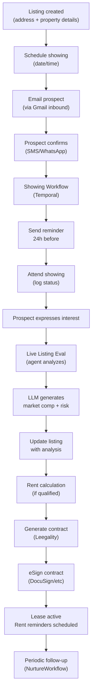

## 13. Billing workflow

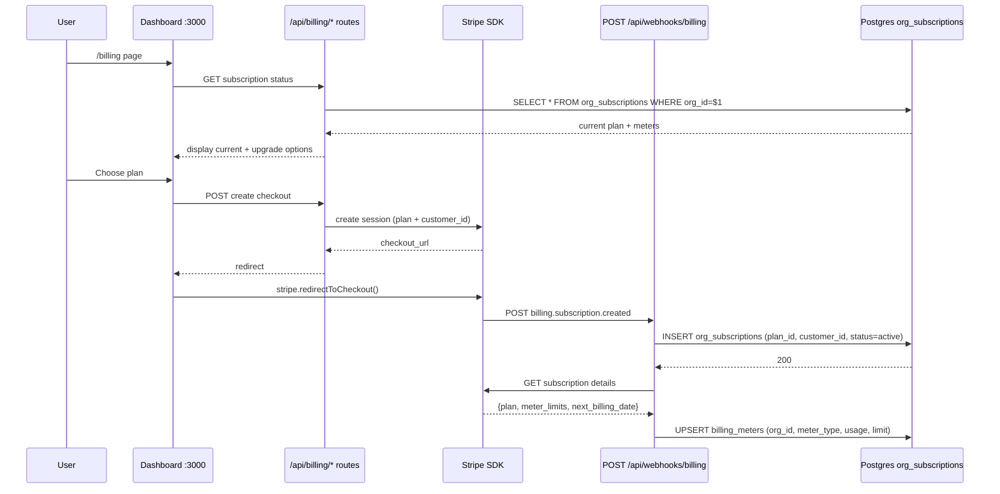

## 14. Security: RBAC + audit + RLS

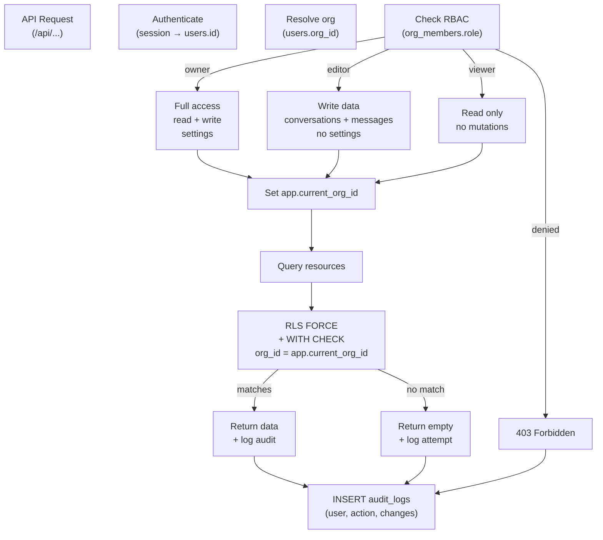

## 15. Session & cache layer

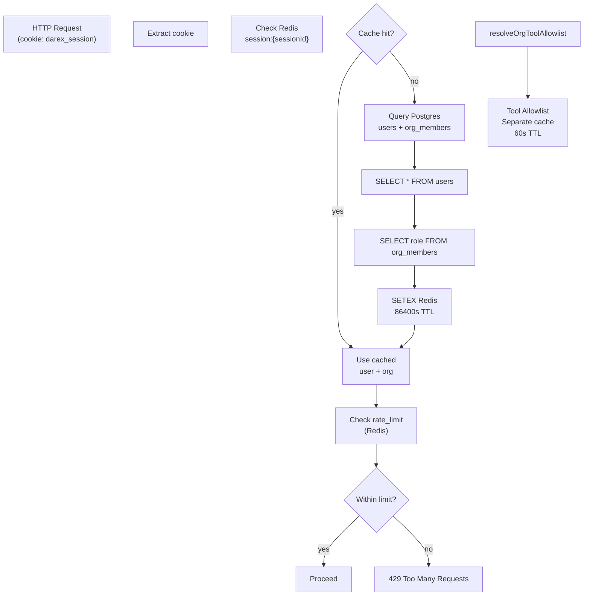

## 16. Error handling & fallbacks

```mermaid
graph TD
  Entry["Request enters"]
  Try["Try Temporal"]
  TemporalOK{Temporal<br/>responds?}
  TemporalOK -->|timeout/error| Fallback["Use Direct Agent"]
  TemporalOK -->|ok| Execute["Temporal Workflow<br/>executes"]

  TempErr["Temporal Error<br/>(worker down)"]
  TempErr --> Fallback

  Fallback --> Direct["runAutonomousAgentDirect"]
  Direct --> AAError{atomic-agent<br/>error?}
  AAError -->|yes| JSONFallback["Return error JSON<br/>+ retry UI"]
  AAError -->|no| Success["Success"]

  Execute --> WorkflowErr{Workflow<br/>failed?}
  WorkflowErr -->|activity timeout| Retry["Retry with backoff<br/>(2s-30s)"]
  WorkflowErr -->|permanent| Fail["Log error<br/>+ notify user"]

  Fallback --> ToolErr{Tool execution<br/>failed?}
  ToolErr -->|rate limit| ThrottleWait["Wait 60s<br/>+ retry"]
  ToolErr -->|auth (OAuth)| ConnError["Return connected:false<br/>+ /connectors link"]
  ToolErr -->|network| Retry
  ToolErr -->|logic| Fail

  Success --> LogTrace["Log to Langfuse"]
  Retry --> LogTrace
  Fail --> LogTrace
  ConnError --> LogTrace
```

## 17. Component dependency (import graph)

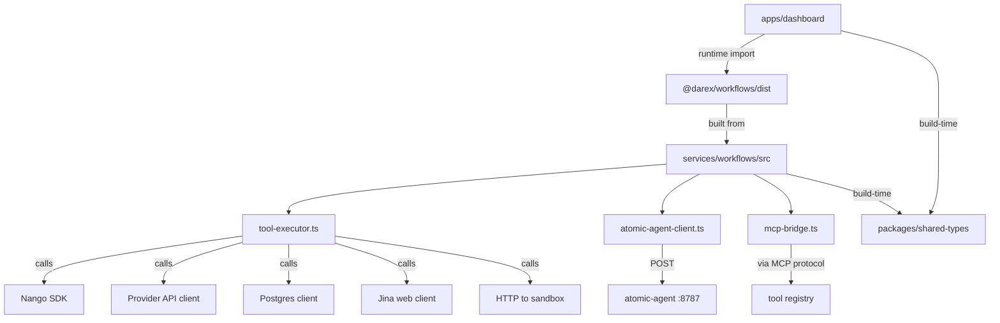

## 18. Realtime event flow (SSE)

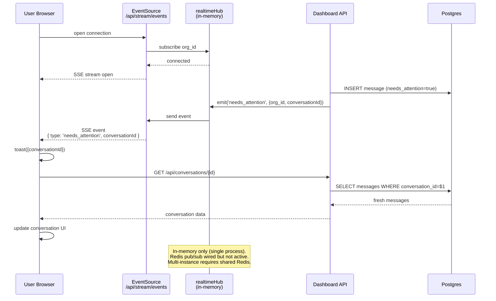

## 19. Langfuse observability

```mermaid
graph TD
  Start["User runs Ask AI"]
  Trace["Create Trace<br/>(ask_ai_session)"]
  Classify["Trace Span<br/>(classify_request)"]
  Plan["Trace Span<br/>(generate_plan)"]
  Agent["Trace Span<br/>(agent_turn)"]
  Tools["Trace Spans<br/>(tool_execution)"]

  Trace --> Classify
  Trace --> Plan
  Trace --> Agent
  Agent --> Tools

  Tools -->|send| Langfuse["Langfuse :3002<br/>(HTTP batch)"]
  Langfuse -->|store| ClickHouse["ClickHouse<br/>(persistence)"]
  ClickHouse -->|serve| Dashboard["Langfuse Dashboard<br/>(charts + latency)"]

  Note over Langfuse: Schema fixed (event-level timestamp).<br/>ClickHouse persistence still flaky.<br/>Fallback: in-memory buffer.
```

## 20. Scaling architecture (future)

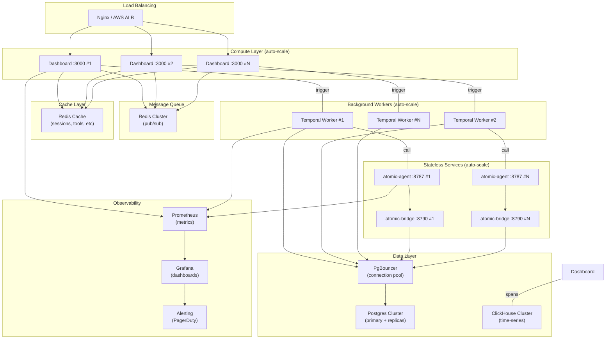

All diagrams describe the **current state** as of commit `604d97a` (2026-08-14).
