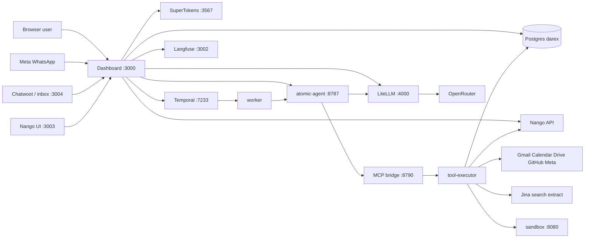
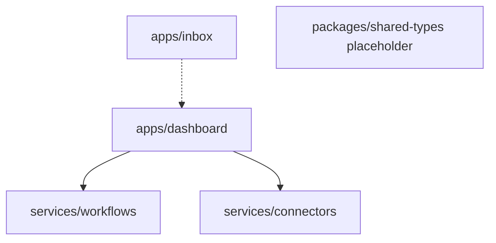
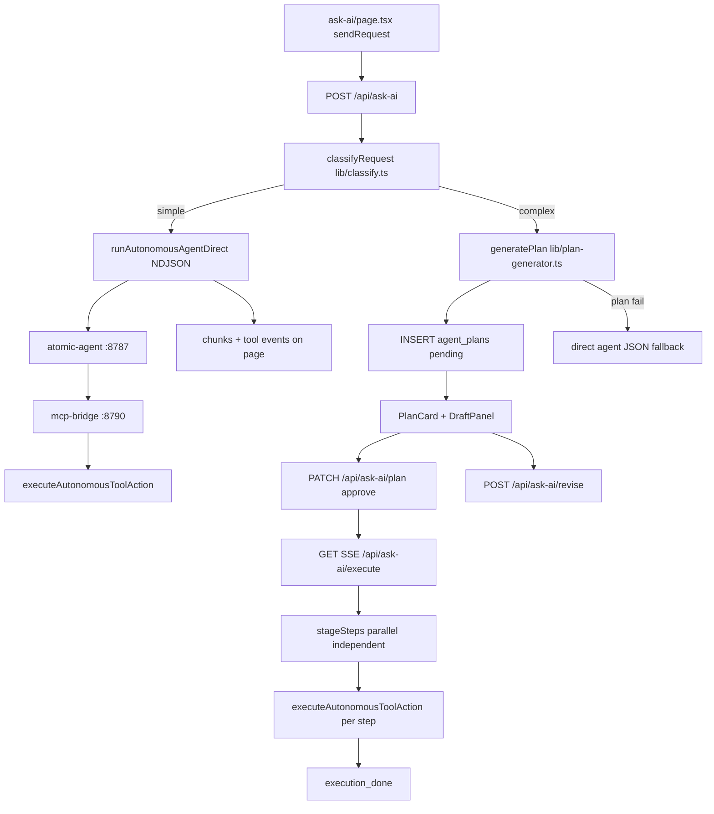
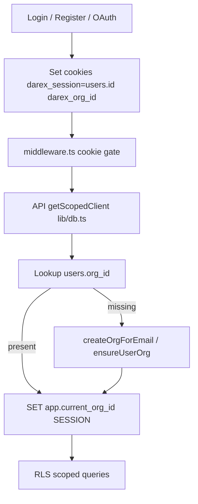
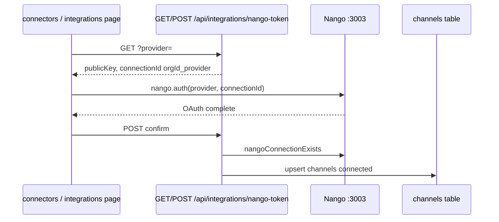
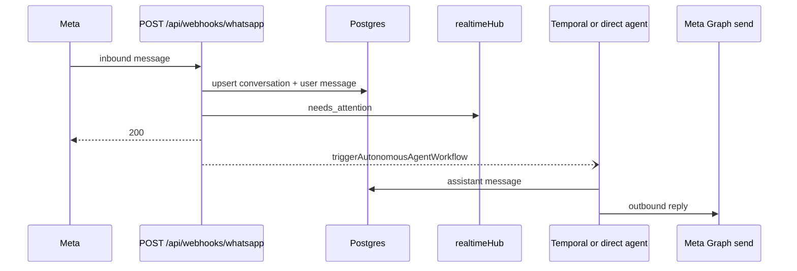
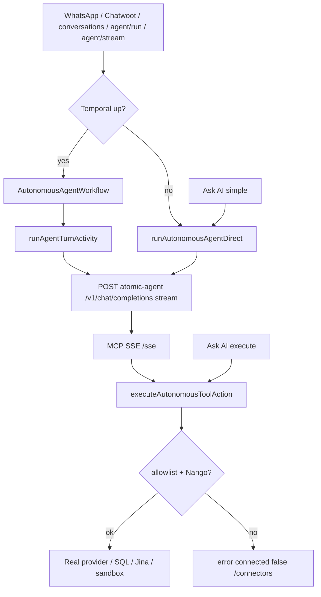
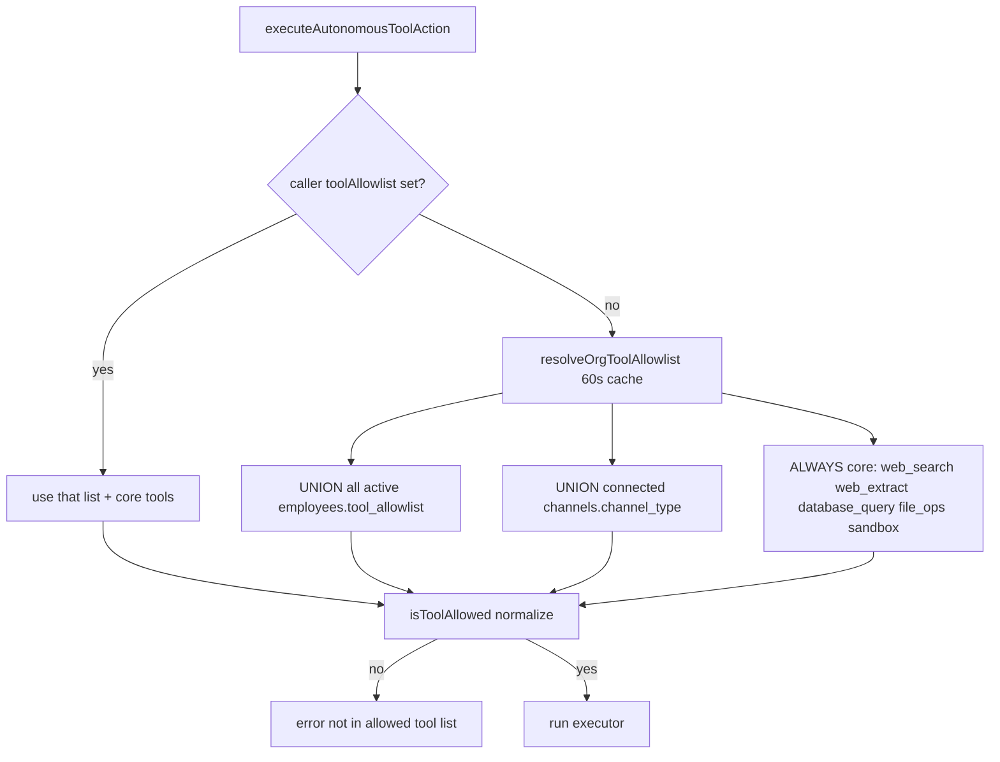
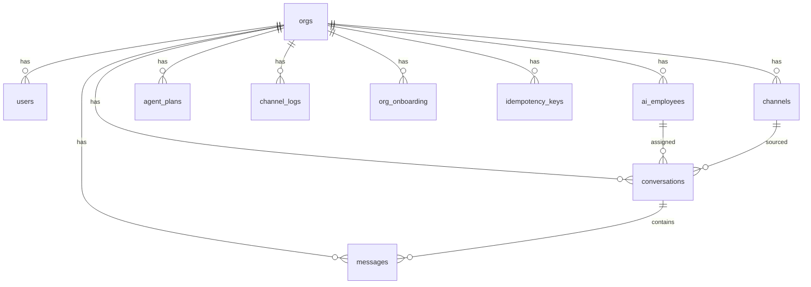
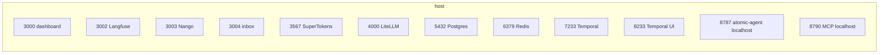

# 02 — Architecture diagrams

All diagrams are mermaid (render in GitHub / Cursor preview). They describe the
**current code**, not the original spec.

## 1. System context

```mermaid
flowchart LR
  User[Browser user]
  Meta[Meta WhatsApp]
  Chatwoot[Chatwoot / inbox :3004]
  NangoUI[Nango UI :3003]

  Dash[Dashboard :3000]
  User --> Dash
  Meta --> Dash
  Chatwoot --> Dash
  NangoUI --> Dash

  Dash --> PG[(Postgres darex)]
  Dash --> ST[SuperTokens :3567]
  Dash --> AA[atomic-agent :8787]
  Dash --> LLM[LiteLLM :4000]
  Dash --> T[Temporal :7233]
  Dash --> Nango[Nango API]
  Dash --> LF[Langfuse :3002]

  T --> Worker[worker]
  Worker --> AA
  AA --> Bridge[MCP bridge :8790]
  Bridge --> Exec[tool-executor]
  Exec --> Nango
  Exec --> APIs[Gmail Calendar Drive GitHub Meta]
  Exec --> PG
  Exec --> Jina[Jina search extract]
  Exec --> SB[sandbox :8080]
  LLM --> OR[OpenRouter]
  AA --> LLM
```

## 2. Monorepo dependency graph

```mermaid
flowchart TD
  Dash["apps/dashboard"]
  Inbox["apps/inbox"]
  WF["services/workflows"]
  Conn["services/connectors"]
  ST["packages/shared-types placeholder"]

  Dash --> WF
  Dash --> Conn
  Inbox -.-> Dash
```

Dashboard imports `@darex/workflows/dist/atomic-agent-client` and
`@darex/workflows/dist/tool-executor` at runtime. `@darex/connectors` is used
only by `POST /api/integrations/test`.

## 3. Ask AI — classify then two paths

```mermaid
flowchart TD
  UI["ask-ai/page.tsx sendRequest"] --> POST["POST /api/ask-ai"]
  POST --> CL["classifyRequest lib/classify.ts"]
  CL -->|simple| AG["runAutonomousAgentDirect NDJSON"]
  AG --> AA["atomic-agent :8787"]
  AA --> MCP["mcp-bridge :8790"]
  MCP --> TE["executeAutonomousToolAction"]
  AG --> UI2["chunks + tool events on page"]

  CL -->|complex| PL["generatePlan lib/plan-generator.ts"]
  PL --> DB["INSERT agent_plans pending"]
  DB --> CARD["PlanCard + DraftPanel"]
  CARD --> AP["PATCH /api/ask-ai/plan approve"]
  AP --> EX["GET SSE /api/ask-ai/execute"]
  EX --> STAGE["stageSteps parallel independent"]
  STAGE --> TE2["executeAutonomousToolAction per step"]
  TE2 --> DONE["execution_done"]
  PL -->|plan fail| FB["direct agent JSON fallback"]
  CARD --> RV["POST /api/ask-ai/revise"]
```

## 4. Auth and tenancy

```mermaid
flowchart TD
  A["Login / Register / OAuth"] --> B["Set cookies darex_session=users.id darex_org_id"]
  B --> C["middleware.ts cookie gate"]
  C --> D["API getScopedClient lib/db.ts"]
  D --> E["Lookup users.org_id"]
  E -->|missing| G["createOrgForEmail / ensureUserOrg"]
  E -->|present| H["SET app.current_org_id SESSION"]
  G --> H
  H --> I["RLS scoped queries"]
```

## 5. Nango connect

```mermaid
sequenceDiagram
  participant UI as connectors / integrations page
  participant NT as GET/POST /api/integrations/nango-token
  participant Nango as Nango :3003
  participant DB as channels table

  UI->>NT: GET ?provider=
  NT-->>UI: publicKey, connectionId orgId_provider
  UI->>Nango: nango.auth(provider, connectionId)
  Nango-->>UI: OAuth complete
  UI->>NT: POST confirm
  NT->>Nango: nangoConnectionExists
  NT->>DB: upsert channels connected
```

## 6. WhatsApp inbound (fire-and-forget)

```mermaid
sequenceDiagram
  participant Meta
  participant WH as POST /api/webhooks/whatsapp
  participant DB as Postgres
  participant Hub as realtimeHub
  participant T as Temporal or direct agent
  participant Graph as Meta Graph send

  Meta->>WH: inbound message
  WH->>DB: upsert conversation + user message
  WH->>Hub: needs_attention
  WH-->>Meta: 200
  WH--)T: triggerAutonomousAgentWorkflow
  T->>DB: assistant message
  T->>Graph: outbound reply
```

Chatwoot webhook persists, returns 200, then starts the agent (`fireInboundAgent`). Body `org_id` is ignored.

## 7. Agent runtime (Temporal vs direct)

```mermaid
flowchart TD
  Callers["WhatsApp / Chatwoot / conversations / agent/run / agent/stream"] --> TryT{"Temporal up?"}
  TryT -->|yes| WF["AutonomousAgentWorkflow"]
  WF --> ACT["runAgentTurnActivity"]
  TryT -->|no| DIR["runAutonomousAgentDirect"]
  AskAI["Ask AI simple"] --> DIR
  ACT --> AA["POST atomic-agent /v1/chat/completions stream"]
  DIR --> AA
  AA --> MCP["MCP SSE /sse"]
  MCP --> EX["executeAutonomousToolAction"]
  EX --> AL{"allowlist + Nango?"}
  AL -->|ok| API["Real provider / SQL / Jina / sandbox"]
  AL -->|no| ERR["error connected false /connectors"]
  PlanEx["Ask AI execute"] --> EX
```

## 8. Tool allowlist

```mermaid
flowchart TD
  Call["executeAutonomousToolAction"] --> Exp{"caller toolAllowlist set?"}
  Exp -->|yes| Use["use that list + core tools"]
  Exp -->|no| Res["resolveOrgToolAllowlist 60s cache"]
  Res --> U["UNION all active employees.tool_allowlist"]
  Res --> C["UNION connected channels.channel_type"]
  Res --> Core["ALWAYS core: web_search web_extract database_query file_ops sandbox"]
  Use --> Match["isToolAllowed normalize"]
  U --> Match
  C --> Match
  Core --> Match
  Match -->|no| Reject["error not in allowed tool list"]
  Match -->|yes| Run["run executor"]
```

## 9. Data model (tenant tables)

```mermaid
erDiagram
  orgs ||--o{ users : has
  orgs ||--o{ ai_employees : has
  orgs ||--o{ channels : has
  orgs ||--o{ conversations : has
  orgs ||--o{ messages : has
  orgs ||--o{ agent_plans : has
  orgs ||--o{ channel_logs : has
  orgs ||--o{ org_onboarding : has
  orgs ||--o{ idempotency_keys : has
  conversations ||--o{ messages : contains
  ai_employees ||--o{ conversations : assigned
  channels ||--o{ conversations : sourced
```

`orgs` has **no RLS** (tenant root). Every other table is `FORCE ROW LEVEL SECURITY`
with `USING` + `WITH CHECK` on `org_id = current_setting('app.current_org_id')`.

## 10. Docker network (ports)

```mermaid
flowchart LR
  subgraph host
    D3000[3000 dashboard]
    L3002[3002 Langfuse]
    N3003[3003 Nango]
    I3004[3004 inbox]
    ST3567[3567 SuperTokens]
    LLM4000[4000 LiteLLM]
    PG5432[5432 Postgres]
    R6379[6379 Redis]
    T7233[7233 Temporal]
    TUI8233[8233 Temporal UI]
    AA8787[8787 atomic-agent localhost]
    BR8790[8790 MCP localhost]
  end
```

Sandbox listens on **8080 inside the network only** (no host publish).
