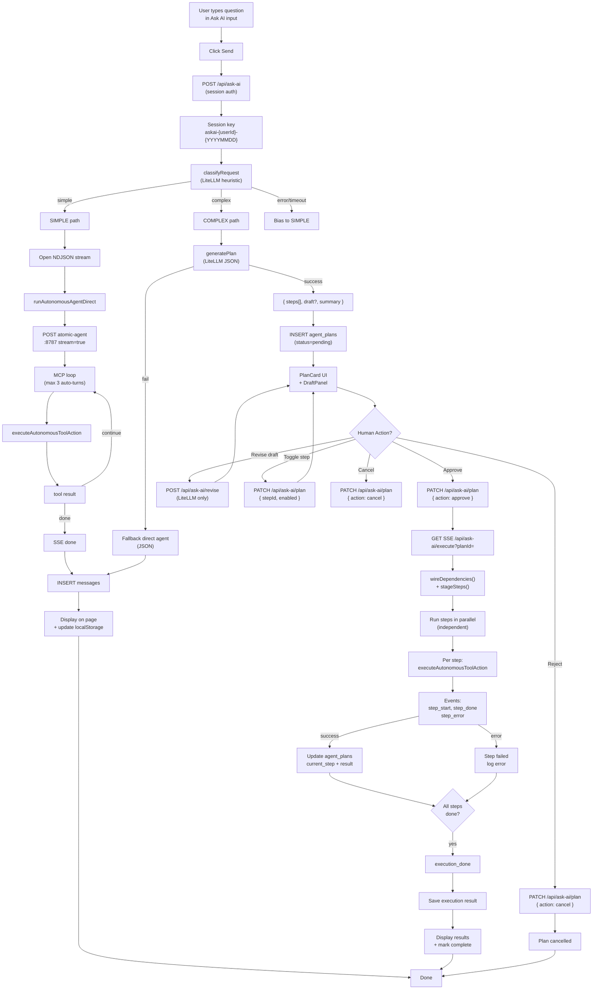
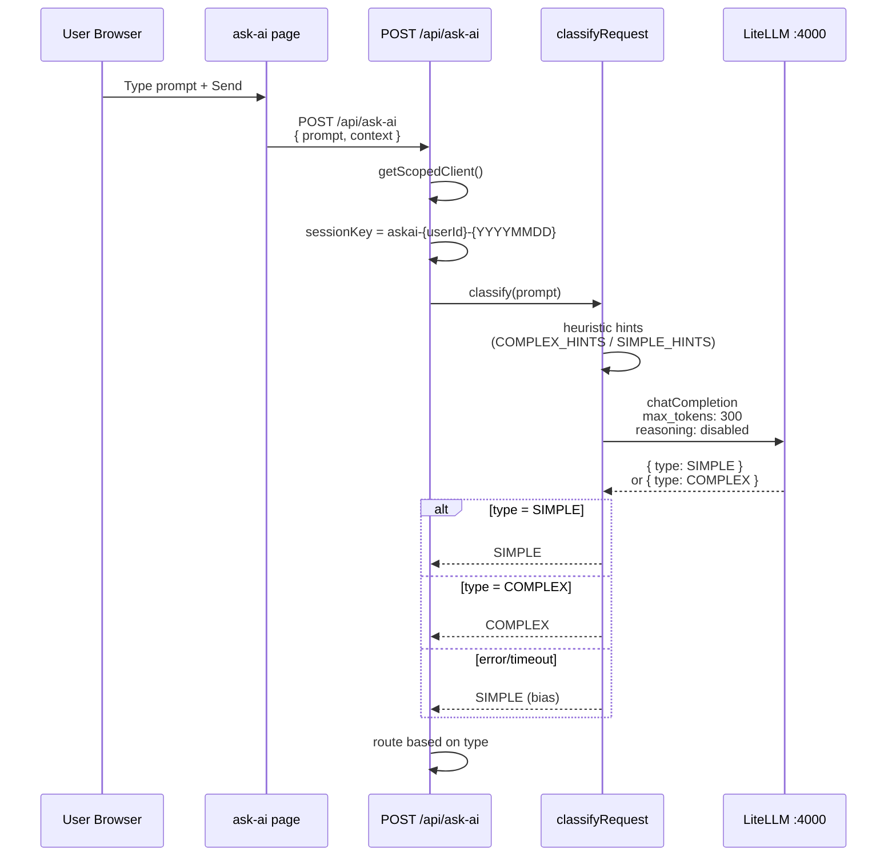
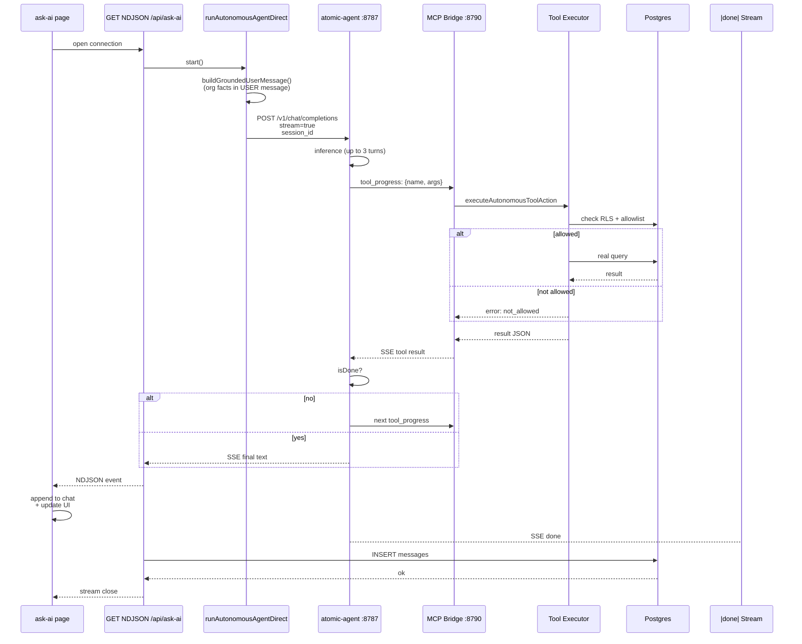
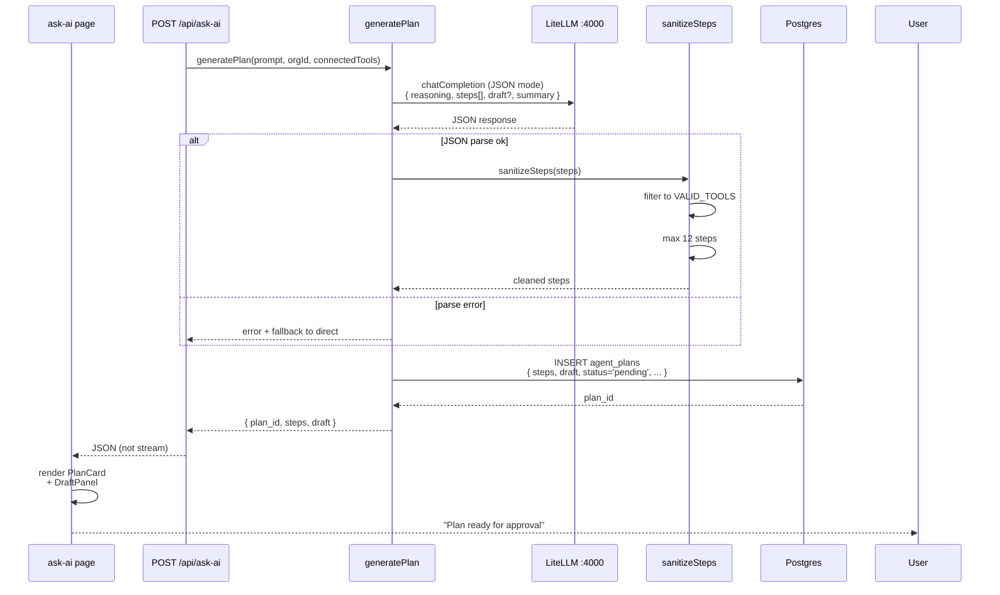
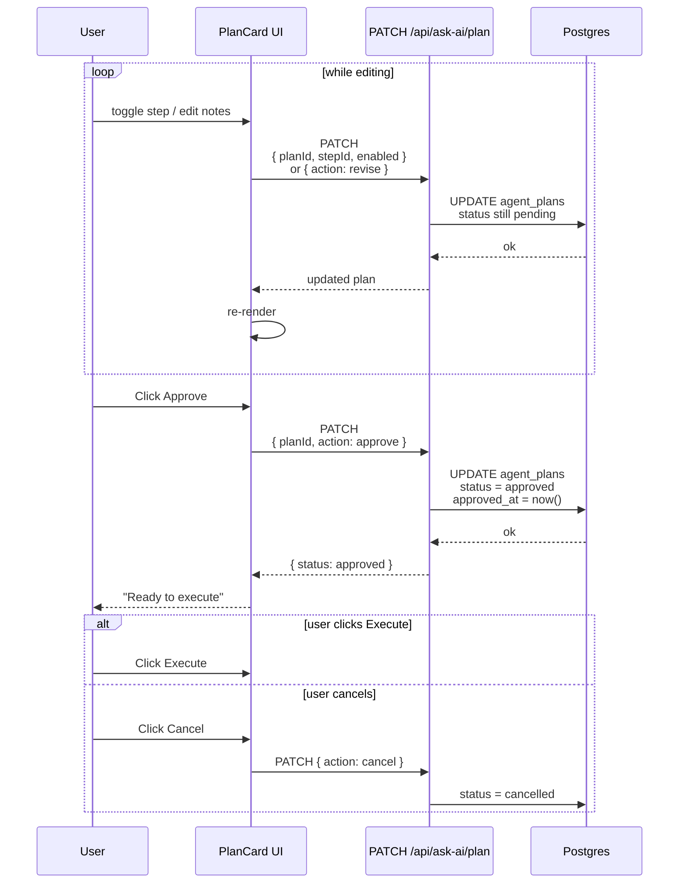
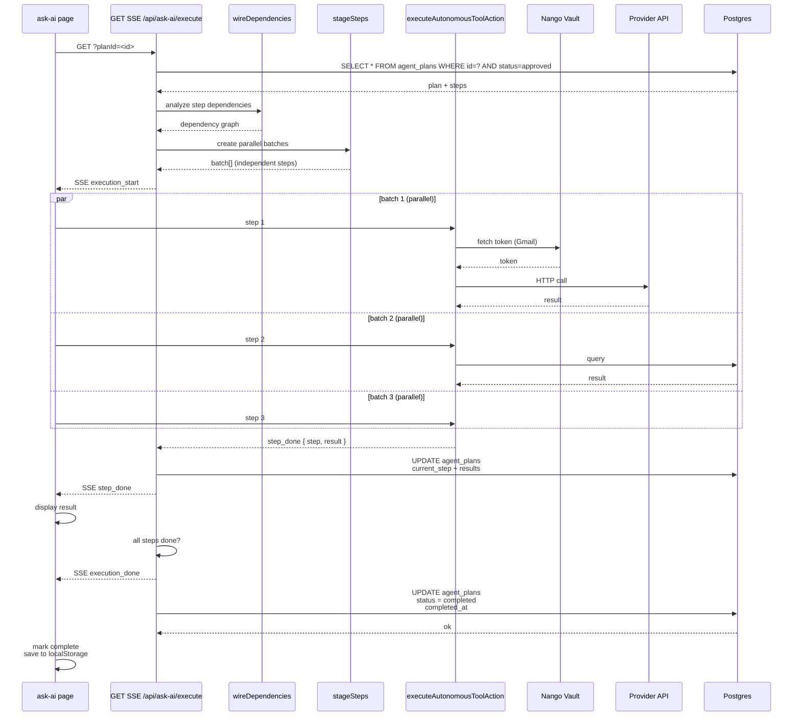

# 03 — End-to-end: Ask AI

Primary product path. All steps shown as sequence diagrams below. Files:

| Layer | Path |
|-------|------|
| UI | `apps/dashboard/app/(dashboard)/ask-ai/page.tsx` |
| Classify | `apps/dashboard/lib/classify.ts` |
| Plan | `apps/dashboard/lib/plan-generator.ts` |
| LiteLLM | `apps/dashboard/lib/litellm-client.ts` |
| POST entry | `apps/dashboard/app/api/ask-ai/route.ts` |
| Plan CRUD | `apps/dashboard/app/api/ask-ai/plan/route.ts` |
| Revise draft | `apps/dashboard/app/api/ask-ai/revise/route.ts` |
| Execute SSE | `apps/dashboard/app/api/ask-ai/execute/route.ts` |
| Agent | `services/workflows/src/atomic-agent-client.ts` |
| Tools | `services/workflows/src/tool-executor.ts` |

Chat UI components: `PlanCard`, `DraftPanel`, `ExecutionStrip`,
`ActionPermissionCard`, `ReasoningStrip`, `FormattedMarkdownResponse`.

Thread state: canonical history is the `messages` table for the Ask AI
conversation (`GET /api/ask-ai`). `localStorage` is a cache. Plans persist in
`agent_plans` and reload on refresh.

## Complete Ask AI flow diagram

## Sequence diagram: Step 1-2 (Send + Classify)

## Sequence diagram: Step 3a (Simple streaming)

## Sequence diagram: Step 3b (Complex plan generation)

## Sequence diagram: Step 4 (Human plan editing)

## Sequence diagram: Step 5 (Plan execution)

---

## Step 1 — User sends a prompt

`sendRequest()` POSTs `/api/ask-ai` with the prompt. Session cookie supplies
org. Route **does not** take `org_id` from the body.

Session key for atomic-agent: `askai-{userId}-{YYYYMMDD}` so a poisoned session
cannot last more than a day.

---

## Step 2 — Classify (`classifyRequest`)

1. Cheap heuristics (`COMPLEX_HINTS` / `SIMPLE_HINTS`).
2. LiteLLM `chatCompletion` with `max_tokens: 300`, `reasoning: { enabled: false }`.
3. Expect `{"type":"SIMPLE"}` or `{"type":"COMPLEX"}`.
4. On timeout / garbage / uncertainty → **bias to simple**.

Complex means: tools, record changes, inbox triage, drafts, scheduling, CRM,
analytics over data, anything that should be approved first.

---

## Step 3a — Simple → stream

Route opens an NDJSON stream and calls `runAutonomousAgentDirect`:

1. POST `ATOMIC_AGENT_URL/v1/chat/completions` with `stream: true`.
2. Org facts in the **user** message (`buildGroundedUserMessage`) because
   atomic-agent drops the OpenAI `system` role.
3. atomic-agent may call MCP tools on `:8790`.
4. Chunks + `tool` events go to the page until the turn ends.

Verified live: DB count question answered in ~6–7s; unconnected GitHub returns
an honest “not connected via Nango” reply (no `org_id` hunting loop).

---

## Step 3b — Complex → plan

`generatePlan(prompt, orgId, connectedTools)`:

- LiteLLM JSON: `reasoning`, `steps[]` (`tool`, `action`, `payload`, `description`),
  optional `draft`, `summary`.
- `sanitizeSteps` keeps only tools in `VALID_TOOLS` (gmail, calendars, drive,
  docs, sheets, github, whatsapp, hubspot, ads, slack, notion, stripe, shopify,
  zendesk, intercom, razorpay, google-analytics, google-chat, google-meet,
  google-search-console, google-business-profile, google-cloud, database_query,
  web_search, web_extract, file_ops, sandbox). Max 12 steps.
- Insert `agent_plans` row `status='pending'`.
- Response is JSON (not a stream). UI shows `PlanCard` + `DraftPanel`.

If plan generation fails, the route falls back to a **direct agent JSON** run
so the user still gets an answer.

---

## Step 4 — Human edits the plan

| Action | API |
|--------|-----|
| Toggle a step | `PATCH /api/ask-ai/plan` while pending |
| Approve | `PATCH` `{ action: 'approve' }` |
| Cancel | `PATCH` `{ action: 'cancel' }` |
| Revise draft copy | `POST /api/ask-ai/revise` → `reviseDraft()` |

---

## Step 5 — Execute (SSE)

`GET /api/ask-ai/execute?planId=`

1. Load approved plan. Reject if not approved.
2. `wireDependencies()` then `stageSteps()` — independent steps run **in parallel**.
3. Each step: `executeAutonomousToolAction` with `toolAllowlist` = plan tools +
   always-allowed core tools.
4. Events: `execution_start`, `step_start`, `step_done`, `step_error`,
   `execution_done`.
5. `agent_plans` updated mid-stream (`current_step`, step results).
6. Langfuse traces: `PlanExecution-<tool>` + `PlanExecutionSummary`.

This path **does not** call atomic-agent. The plan is the program.

Verified live (2026-08-11): complex prompt → plan with gmail `draft_email` →
approve → execute stream in ~13s. Draft itself 403’d until Gmail was
re-connected with `gmail.compose`.

---

## What works

- Simple streaming Q&A with real tools. SSE `done` is applied on the page.
- Complex plan persist / refresh-safe / approve / cancel / toggle / extra
  instructions (notes, not a fake tool) / revise.
- Execute 409s already-completed plans and finishes after SSE disconnect.
- Home `/ask-ai?q=` works. History hydrates from `messages`.
- Honest `notConnected` when OAuth is missing (`setupUrl`).
- Daily session rotation (no unbounded poisoned WAL).

## What does not (on this path)

- Classifier can still mis-tag; fallback prefers simple (user may not see a
  plan when they expected one).
- No multi-user shared Ask AI thread.
- Google Chat/Meet/Analytics/etc. are in `VALID_TOOLS` and have executors; they
  still need a live Nango token.
