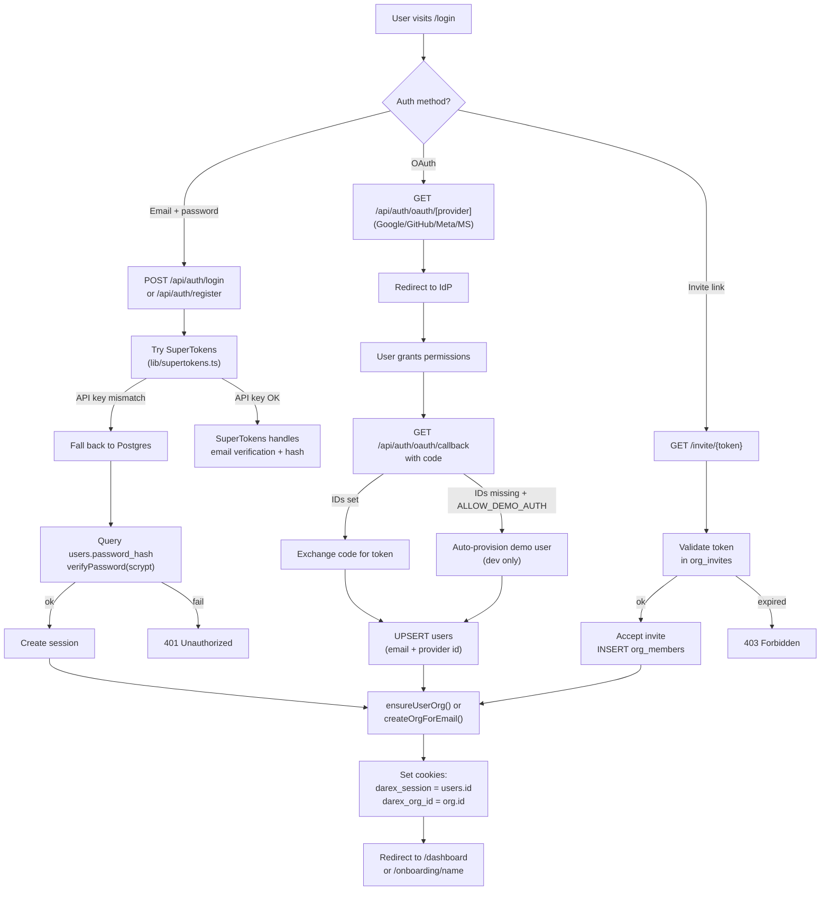
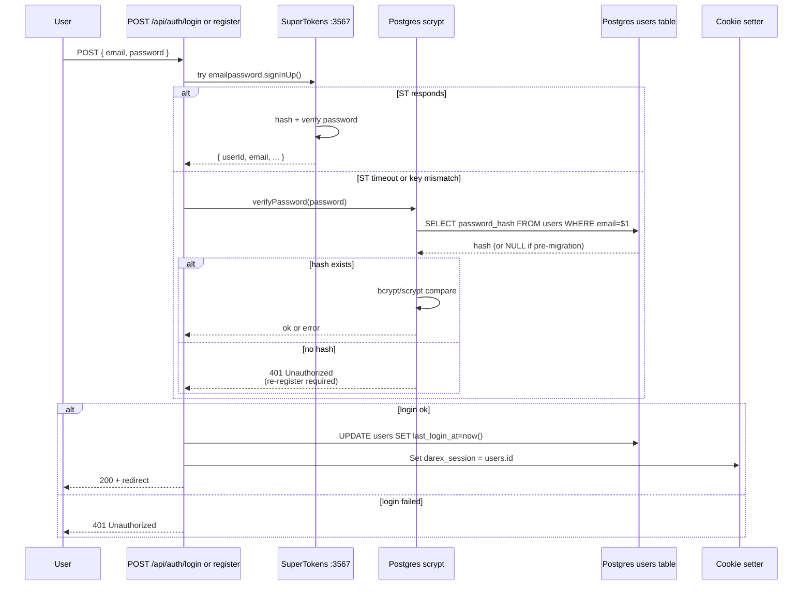
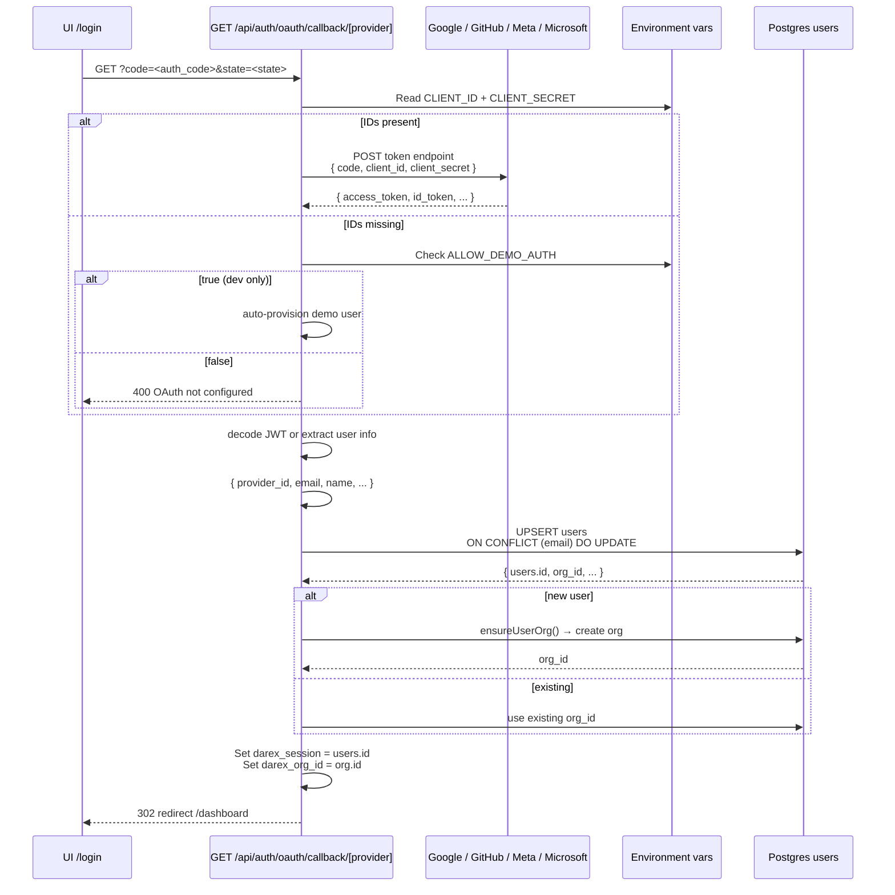
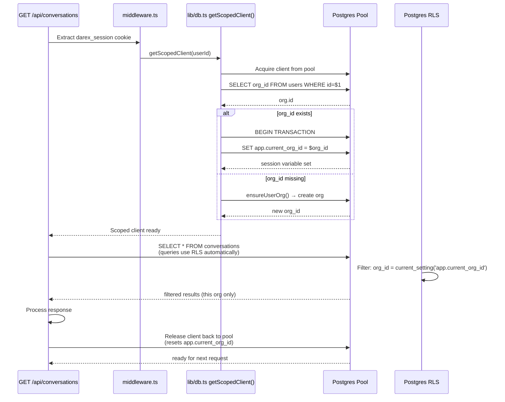
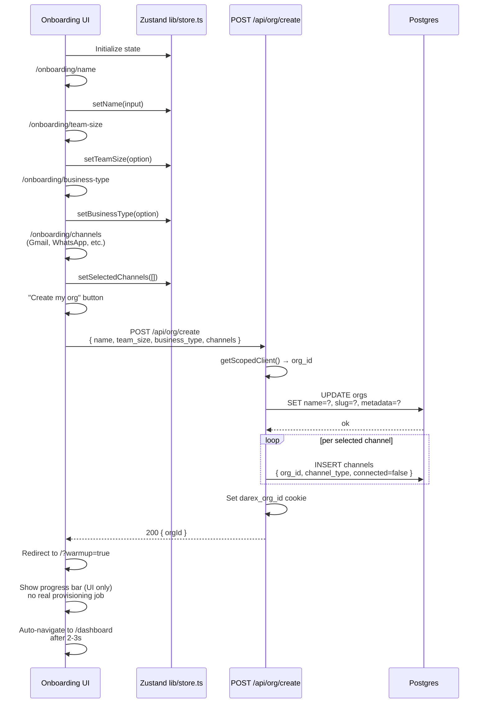
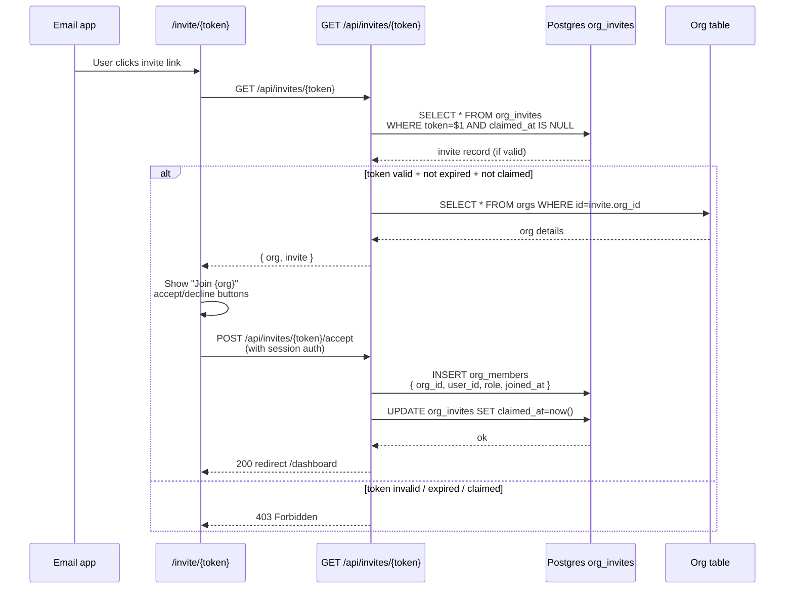

# 04 — End-to-end: Auth and onboarding

## Auth & org creation flow

## Email + password flow (detail)

## OAuth callback flow (detail)

## Org resolution & tenancy (getScopedClient)

## Onboarding wizard sequence

## Invite flow (accept while signed in)

## Cookies

| Cookie | Value | Notes |
|--------|-------|-------|
| `darex_session` | Postgres `users.id` | httpOnly, 7 days. **Not** the SuperTokens user id. |
| `darex_org_id` | Org UUID | Set at login / register / OAuth / org create |

| Cookie | Value | Notes |
|--------|-------|-------|
| `darex_session` | Postgres `users.id` | httpOnly, 7 days. **Not** the SuperTokens user id. |
| `darex_org_id` | Org UUID | Set at login / register / OAuth / org create |

`middleware.ts` only checks `darex_session` on non-API pages. Unauthenticated
→ `/login?redirect=`. It does **not** force onboarding completion.

## Email + password

`POST /api/auth/login` and `POST /api/auth/register` in
`app/api/auth/[[...path]]/route.ts`.

1. Try SuperTokens EmailPassword (`lib/supertokens.ts`).
2. If SuperTokens is down or `SUPERTOKENS_API_KEY` mismatches the server
   `API_KEYS`, fall back to Postgres:
   - Register: scrypt `password_hash` on `users`.
   - Login: `verifyPassword`; missing hash or wrong password → 401.
   - **No auto-provision on bad password** (that hole was closed in Phase 4.5).

Users created **before** migration `004_password_hash.sql` have NULL
`password_hash` and must re-register to use the Postgres path.

## Session GET / logout

- `GET /api/auth/session` → `{ authenticated, userId, email, role, orgId }`
- `GET /api/auth/logout` and `/api/auth/signout` clear cookies and redirect `/login`

## Social OAuth

`GET /api/auth/oauth/[provider]` and `GET /api/auth/oauth/callback/[provider]`

Providers: `google`, `github`, `meta`/`facebook`, `microsoft`.

- Real path: redirect to IdP with env client IDs/secrets, exchange code,
  upsert user, set cookies.
- If `ALLOW_DEMO_AUTH=true` **and** client IDs are missing: auto-provision a
  demo user (dev only).

## Org resolution (`lib/db.ts`)

`getScopedClient()` / `getOrgScopedClient()`:

1. Read `darex_session`.
2. Load `users.org_id`.
3. If missing, `ensureUserOrg()` / `createOrgForEmail()` — **one org per user**,
   never “first org in the table”.
4. `SET app.current_org_id` at **session** level on the pooled client.
5. Reset on release (pool max is 10 — do not hold across SSE).

APIs must not take `org_id` from the JSON body.

## Onboarding wizard

Pages under `app/(onboarding)/onboarding/`:

1. `/onboarding/name` — Zustand `lib/store.ts`
2. `/onboarding/team-size`
3. `/onboarding/business-type`
4. `/onboarding/channels` — `POST /api/org/create` then `/?warmup=true`

`POST /api/org/create` updates/creates the org, seeds `channels` rows for
selected types, sets `darex_org_id`.

Home `?warmup=true` shows a **UI-only** progress bar (no real provisioning job).

## What works

- Register → unique org → login → scoped APIs.
- SuperTokens when keys match; Postgres fallback when they don’t.
- OAuth callbacks with real client IDs; `?invite=` survives the round-trip.
- Forgot / reset password; invite accept while signed in.
- Onboarding writes org + channel stubs. Body `org_id` is rejected.

## What does not

- Middleware does not send users without an org into onboarding (it uses the
  onboarding cookie).
- Invite email needs `RESEND_API_KEY`; without it Settings still returns a
  copyable `/invite/{token}` link (`org_invites`).
- Demo OAuth bypass is dangerous if `ALLOW_DEMO_AUTH` leaks to prod.
- SuperTokens Dashboard recipe is initialized; not a product surface.
