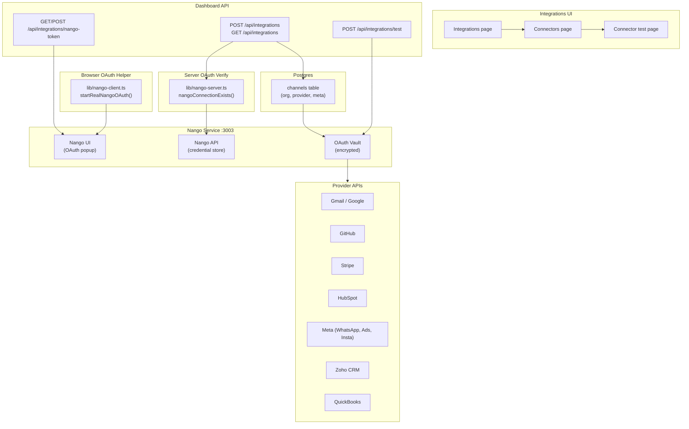
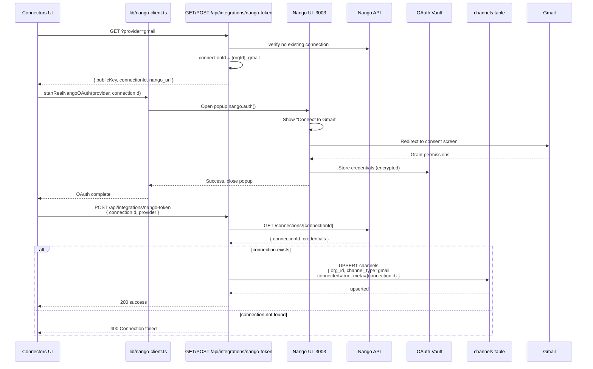
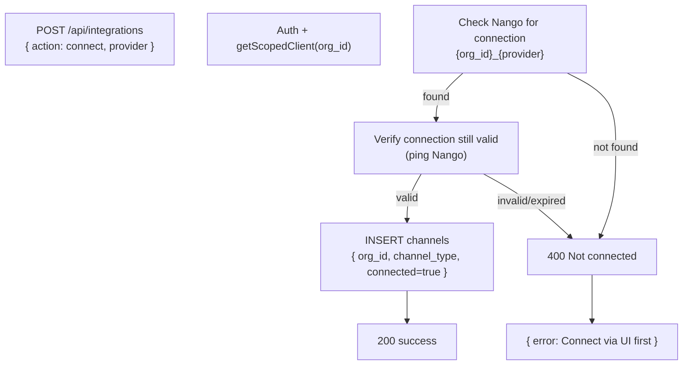
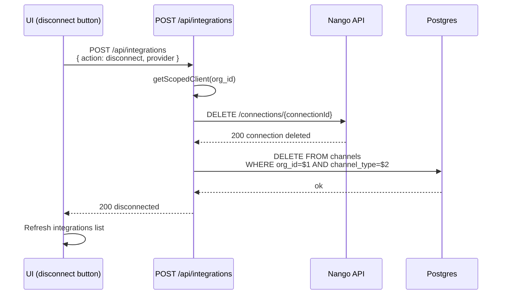
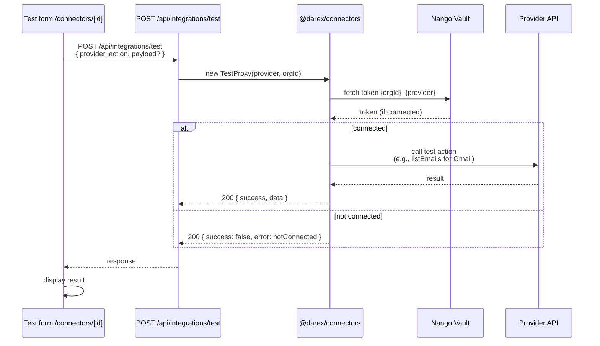
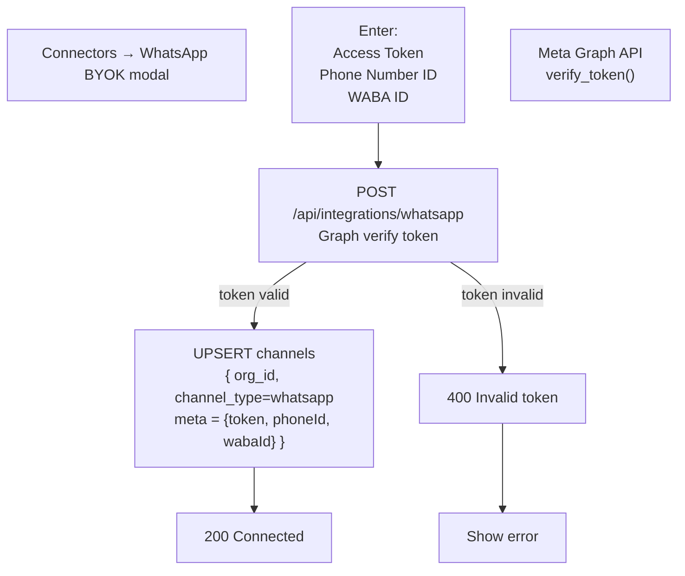

# 05 — End-to-end: Integrations (Nango)

Nango (`:3003`) is the OAuth vault. The agent never stores provider refresh
tokens itself. Connection id convention: **`{orgId}_{provider}`**.

## Nango architecture

## OAuth connect flow (detailed)

## Connect via POST (no fabrication)

## Disconnect flow

## Test connector

## WhatsApp BYOK (bring your own key)

## UI

| Page | File | Job |
|------|------|-----|
| `/integrations` | `app/(dashboard)/integrations/page.tsx` | Hub + test runner |
| `/connectors` | `app/(dashboard)/connectors/page.tsx` | Catalog + OAuth + WhatsApp BYOK modal |
| `/connectors/[id]` | `app/(dashboard)/connectors/[id]/page.tsx` | Per-provider test form |

Browser OAuth helper: `lib/nango-client.ts` → `startRealNangoOAuth()`.
Server verify: `lib/nango-server.ts` → `nangoConnectionExists()`, `getNangoConnection()`.

## Catalog (27 apps in `ALL_INTEGRATIONS`)

Messaging: whatsapp, slack, google-chat  
Email / calendar: gmail, google-calendar  
Ads: google-ads, meta-ads  
CRM / support: hubspot, zendesk, intercom  
Payments: stripe, razorpay  
Knowledge / shop: notion, shopify  
Dev: github  
Google productivity: drive, docs, sheets, slides, forms, contacts, tasks  
Also listed: google-analytics, google-search-console, google-business-profile,
google-cloud, google-meet, google-chat — executors and UI catalog are **live**
(see [08](./08-tools-catalog.md)).

## Connect flow (real OAuth)

1. UI `GET /api/integrations/nango-token?provider=` → public key, host,
   `connectionId`.
2. Browser `nango.auth(provider, connectionId)` against Nango.
3. UI `POST /api/integrations/nango-token` confirm.
4. Server checks Nango **before** upserting `channels` (`status='connected'`).
5. Optional `POST /api/integrations` `{ action: 'connect' }` — **400** if Nango
   has no connection (no fabricated rows).

`GET /api/integrations` re-verifies every DB-connected row against Nango in
parallel. UI “Connected” means Nango agrees.

Disconnect: `POST /api/integrations` `{ action: 'disconnect' }` **deletes**
the Nango connection then clears `channels`.

## WhatsApp BYOK (bypasses Nango)

`POST /api/integrations/whatsapp` Graph-pings then stores
`{ accessToken, phoneNumberId, wabaId }` in `channels.meta`.

## Test proxy (not the agent)

`POST /api/integrations/test` is a **read-only ping** by default (Nango /
WhatsApp Graph / Razorpay). Writes `channel_logs`. This is a diagnostic, not
the MCP path. Shopify/Zendesk require shop/subdomain **before** the OAuth
popup. Missing OAuth client IDs point at Nango UI `:3003`.

The **agent** uses `tool-executor.ts` direct HTTP + Nango tokens. It does not
import `@darex/connectors`.

## What works

- Nango as source of truth (fake-connect removed 2026-08-11).
- Gmail / Calendar / GitHub / Google Ads / Docs / Sheets live-verified when
  connected.
- Google Drive correctly reports not connected until browser OAuth.
- Gmail scopes include `gmail.send gmail.readonly gmail.compose gmail.modify`
  (need a **re-connect** if the token predates `compose`).
- Intercom + Notion `oauth_scopes` filled (`read write`).

## What does not

- HubSpot, Stripe, Notion, Slack, Shopify, Zendesk, Intercom, Meta Ads need
  **real OAuth client IDs** in the Nango UI (`http://localhost:3003`) before
  the popup can finish.
- WhatsApp outbound needs a rotated `META_ACCESS_TOKEN`.
- `POST /api/integrations/webhooks` is an authenticated **logger**, not Meta’s
  public webhook.
