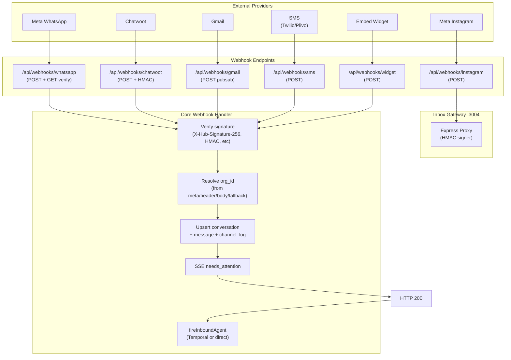
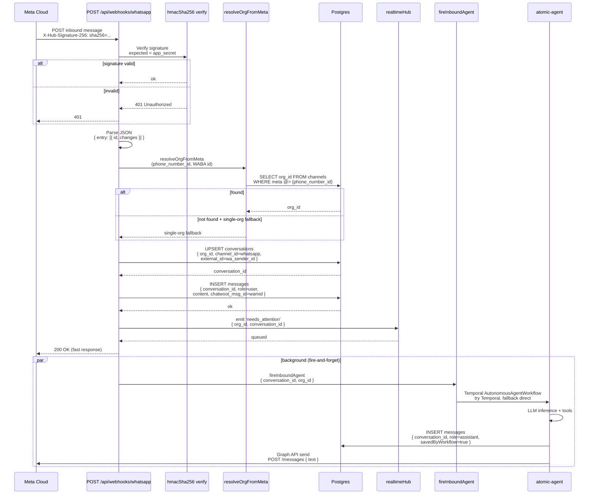

# 06 — End-to-end: Webhooks, inbox, realtime

## Webhook routing architecture

## WhatsApp (Meta Cloud API)

File: `apps/dashboard/app/api/webhooks/whatsapp/route.ts`

### GET — verification

Meta challenge. Compares `hub.verify_token` to `VERIFY_TOKEN`.

### POST — inbound sequence

### WhatsApp inbound rules

- Verify `X-Hub-Signature-256` when the app secret is set.
- Return 200 **before** the LLM.
- Org via SECURITY DEFINER resolvers (phone_number_id / WABA / single-org).
  Never from the JSON body.
- `chatwoot_msg_id` is **text** (Meta `wamid.*`) — migration 006; per-org
  unique with conversation ids in migration 010.
- Duplicate assistant row avoided with `savedByWorkflow`.
- First active AI employee is used as the persona.

**Live E2E (2026-08-10):** inbound persist + real LLM reply **5/5**. Outbound
Graph send logged `401 OAuthException` — `META_ACCESS_TOKEN` expired
2026-06-12. Pipeline itself is correct.

Production still needs the Meta Developer Console webhook URL:
`https://<domain>/api/webhooks/whatsapp`.

---

## Chatwoot-format webhook

File: `apps/dashboard/app/api/webhooks/chatwoot/route.ts`

1. Optional HMAC `x-chatwoot-signature: sha256=<hex>` when
   `CHATWOOT_WEBHOOK_SECRET` is set. Missing/wrong → 401.
2. Org via `?org_id=`, `Authorization: Bearer` matching `orgs.meta.webhook_secret`,
   `X-Darex-Org-Id`, or single-org fallback.
3. Upsert channel / conversation / message.
4. Publish `needs_attention`.
5. **Starts the AI agent** via `fireInboundAgent` (Temporal, then direct).
   Body `org_id` is ignored.

Phase 3 check script signs the body; **6/6 PASS**.

---

## Inbox gateway (`apps/inbox`)

Express on `:3004`. README still talks about a Chatwoot fork — **that is
wrong**. Actual code:

| Route | Behavior |
|-------|----------|
| `GET /health` | `{ status: 'ok' }` |
| `POST /webhook/inbound` | HMAC-signs and forwards JSON to `{DASHBOARD_URL}/api/webhooks/chatwoot` |
| `POST /api/inbox/send` | Forwards to dashboard `/api/webhooks/outbound` (HMAC) |

---

## Conversations inbox (dashboard)

Page: `app/(dashboard)/conversations/page.tsx`

- List/filter via `GET /api/conversations`.
- Thread via `GET /api/conversations/[id]/messages`.
- Human reply `POST .../messages` — if role is user/customer, fire-and-forget
  Temporal (then direct) agent.
- New conversation `POST /api/conversations` can trigger the same.
- `PATCH /api/conversations/[id]` status/employee + `conversation_updated`.

Dashboard-sent messages use a **random** `chatwoot_msg_id` (synthetic, inbox-only).

---

## Realtime SSE

| Piece | File |
|-------|------|
| Hub | `apps/dashboard/lib/realtime-hub.ts` in-process EventEmitter keyed by org |
| Endpoint | `GET /api/stream/events` cookie auth, 15s keep-alive |
| Events | `connected`, `needs_attention`, `conversation_updated` |
| Client | Conversations page `EventSource('/api/stream/events')` → auto-select + amber toast |

**Works** on a single `next start` process. **Does not** cross multiple
dashboard replicas (no Redis pub/sub — Phase 8).

Publishers: WhatsApp webhook, Chatwoot webhook, conversation PATCH, messages POST.

---

## What works vs not

| Path | Works? |
|------|--------|
| WhatsApp verify + inbound persist + agent + log outbound | Yes (outbound Graph 401 until token rotation) |
| Chatwoot ingest + HMAC + SSE + agent | Yes |
| Chatwoot → AI auto-reply | **Yes** (`fireInboundAgent`) |
| Inbox inbound proxy | Yes (HMAC) |
| Inbox outbound send | **Yes** → `/api/webhooks/outbound` |
| Inbox UI live toast | Yes (one process) |
| Settings Meta webhook URL | **Correct** — `/api/webhooks/whatsapp` |
