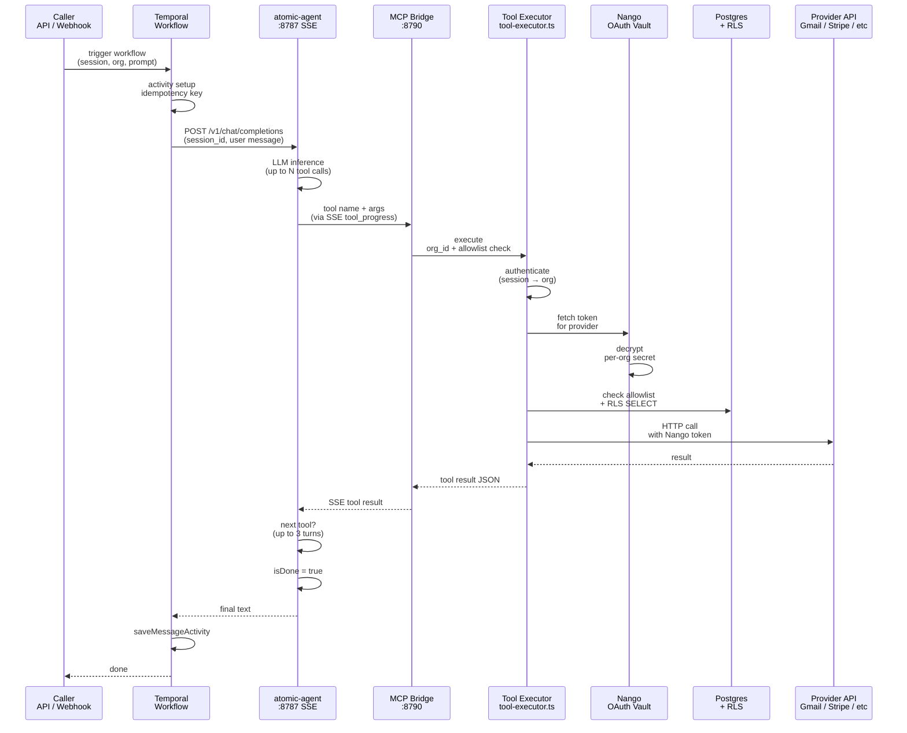

# 07 — End-to-end: Agent runtime

Hermes and LangGraph are gone. One loop:

**Caller → (optional Temporal) → atomic-agent `:8787` → MCP `:8790` →
`executeAutonomousToolAction`.**

Ask AI **plan execute** skips atomic-agent and calls the executor per step.

## Execution paths

```mermaid
graph TD
    Start["Invocation"] --> Route{Router}
    
    Route -->|Ask AI simple| Simple["Direct Agent"]
    Route -->|Ask AI complex| Complex["Plan + Execute"]
    Route -->|Inbound webhook| Inbound["Temporal + Fallback"]
    Route -->|Conversation| Conv["Temporal + Fallback"]
    Route -->|Crew (explicit)| Crew["Crew Workflow"]
    Route -->|Employee console| Emp["Direct Agent"]
    
    Simple --> Agent1["atomic-agent :8787"]
    Agent1 --> MCP1["MCP :8790"]
    MCP1 --> Exec1["Tool Executor"]
    Exec1 --> Result1["Stream NDJSON"]
    
    Complex --> Classify["LiteLLM Classify"]
    Classify --> Plan["Plan Generator<br/>(LiteLLM)"]
    Plan --> Card["PlanCard UI"]
    Card --> Approve{Human Approve?}
    Approve -->|Yes| Execute["Execute Steps<br/>(no atomic-agent)"]
    Approve -->|No| Revise["Revise via LiteLLM"]
    Revise --> Card
    Execute --> Exec2["Tool Executor (parallel)"]
    Exec2 --> SSE["SSE Results"]
    
    Inbound --> Temporal["Temporal Workflow"]
    Temporal -->|3 max turns| Agent2["atomic-agent"]
    Agent2 --> MCP2["MCP"]
    MCP2 --> Exec3["Tool Executor"]
    Exec3 --> Fallback{Temporal up?}
    Fallback -->|No| Agent3["Direct Agent"]
    Agent3 --> MCP3["MCP"]
    Fallback -->|Yes| Save["Save Message"]
    Agent3 --> Save
    
    Conv --> Temporal
    Crew --> CPlanner["Crew Planner<br/>(LiteLLM)"]
    CPlanner --> Fan["Fan-out 3 child<br/>AutonomousAgentWorkflow"]
    Fan --> CSynth["Manager Synthesis<br/>(LiteLLM)"]
    
    Emp --> Agent4["atomic-agent"]
    Agent4 --> MCP4["MCP"]
    MCP4 --> Exec4["Tool Executor"]
    Exec4 --> EmpResult["Action Result"]
```

## Tool execution detail



## Package layout (`services/workflows`)

| File | Role |
|------|------|
| `src/worker.ts` | Temporal worker, queue `darex-agent-tasks` |
| `src/workflows/AutonomousAgentWorkflow.ts` | Solo durable wrapper |
| `src/workflows/CrewWorkflow.ts` | Parallel child spawns (cap 3) + manager synthesis |
| `src/workflows/index.ts` | Worker bundle entry (both workflows) |
| `src/activities/index.ts` | `runAgentTurnActivity`, `saveMessageActivity`, `logChannelActivity` |
| `src/workflow-client.ts` | `triggerAutonomousAgentWorkflow`, `triggerCrewWorkflow` |
| `src/crew-runner.ts` | Direct parallel spawn when Temporal is down |
| `src/atomic-agent-client.ts` | SSE client |
| `src/mcp-bridge.ts` | MCP SSE server |
| `src/tool-executor.ts` | All tool implementations |
| `src/agent-engine.ts` | Shared `AgentTaskInput` / `AgentTaskResult` types only |

`services/workflows/README.md` is stale (still mentions ConversationWorkflow).

## When Temporal vs direct

| Caller | Temporal | Direct fallback |
|--------|----------|-----------------|
| Ask AI simple stream | Never | Always `runAutonomousAgentDirect` |
| Ask AI execute | Never | Direct `executeAutonomousToolAction` |
| `POST /api/agent/run` | First | If Temporal returns null |
| `POST /api/agent/crew` | `CrewWorkflow` first | `runCrewDirect` if Temporal returns null |
| WhatsApp / Chatwoot webhooks | First (`fireInboundAgent`) | Fire-and-forget after 200. **Always solo.** |
| Conversations create / message | `startAutonomousAgentWorkflow` | Persist reply locally |
| `POST /api/agent/stream` | First | Direct SSE if Temporal is down |

## AutonomousAgentWorkflow

1. Activity `runAgentTurnActivity` → `runAgentTurn()` → POST atomic-agent
   `/v1/chat/completions`.
2. atomic-agent runs its own tool loop via MCP.
3. Workflow may loop up to **3** durable turns (`isDone` / `priorToolResults`).
4. Then `logChannelActivity` + `saveMessageActivity`.

Timeouts: 12 min start-to-close, 20 min schedule-to-close, max 2 retries.
Activities use `idempotency_keys`. `isDone` and `priorToolResults` are wired
(max 3 durable turns). Worker reconnects with backoff 2s–30s.

## CrewWorkflow

Explicit spawn only (`POST /api/agent/crew`). Planner is LiteLLM JSON with a
heuristic fallback. Greetings stay solo. Fan-out is capped at **3** child
`AutonomousAgentWorkflow`s, each with its own `sessionKey` and that employee's
tool allowlist (plus core tools). Manager synthesis combines reports. Direct
fallback: `runCrewDirect`. WhatsApp/Chatwoot inbound never calls this.

## atomic-agent client

Env: `ATOMIC_AGENT_URL` (default `http://localhost:8787`),
`ATOMIC_AGENT_API_KEY`, `ATOMIC_AGENT_MODEL` (`atomic-agent`),
`ATOMIC_AGENT_TIMEOUT_MS` (compose default 300000).

- `stream: true`, `session_id`, `X-Atomic-Extensions: on`.
- Session id: `darex:{orgId}:{conversationId|sessionKey|employeeId|chat-{day}}`.
- **System role is dropped by atomic-agent.** Org id + connected channels are
  duplicated into the user text (`buildGroundedUserMessage`).
- Parses SSE: `tool_progress`, `session_id`, `error`, content deltas.
- `sanitizeAgentReply` unwraps JSON envelopes.

Image: `infra/docker/atomic-agent` from AtomicBot-ai/atomic-agent **v0.1.72**.
Active provider in compose: `darex-litellm` → LiteLLM → OpenRouter.

Memory fabric (profile / notes / recall) is **on** inside atomic-agent.
Embeddings / lessons / procedures are **off**. That is **not** Darex pgvector RAG.

## MCP bridge (`mcp-bridge.ts`)

- Port `ATOMIC_BRIDGE_PORT` default **8790**, bind localhost on host.
- `GET /sse`, `POST /messages?sessionId=`.
- Server name `darex` (hyphen-free so cloud LLM tool names resolve).
- Requires a UUID `org_id` before any side effect.
- 62 tools — full list in [08-tools-catalog.md](./08-tools-catalog.md).
- `GET /health` (and `/`) for liveness.

Not on MCP historically: sandbox was executor-only. **`code_execution` is now
on MCP.** Stripe customer create/get and Intercom reply/create are on MCP.

## Custom skills (in the image)

11 playbooks under `infra/docker/atomic-agent/custom-skills/`
(gmail, calendar, drive, docs, sheets, notion, sales-crm, payments, ecommerce,
support-tickets, nango-integrations-playbook).

The Dockerfile **COPY**s them into `starter-skills`. Rebuild the atomic-agent
image after changing playbooks.

## Employee console

`/employees` embeds `AutonomousActionConsole` → `POST /api/agent/run` with that
employee’s persona + `tool_allowlist`.

`GET /api/agent/tools` returns the catalog and **requires a session**.
`POST /api/agent/tools` runs one action with session org.

## Temporal workflows (12+)

| Workflow | Purpose | Triggers |
|----------|---------|----------|
| `AutonomousAgentWorkflow` | Solo agent (max 3 turns) | conversations, inbound, manual run |
| `CrewWorkflow` | Parallel child agents (cap 3) + manager | explicit `/api/agent/crew` only |
| `RAG IngestWorkflow` | Document chunks → embeddings → pgvector | manual trigger or scheduled |
| `RAG RetrieveWorkflow` | Context retrieval before planning | internal to plan generation |
| `WorkItemWorkflow` | Task execution + status tracking | work-item board |
| `PlanExecuteWorkflow` | Durable multi-step plan execution | scheduled plans |
| `NurtureWorkflow` | Lead follow-up automation | scheduled per-prospect |
| `BriefingWorkflow` | Daily digest generation | scheduled daily |
| `MemoryWriteBackWorkflow` | Org learning persistence | post-agent with confidence score |
| ... + integration-specific workflows | Per Zoho / QBO / Leegality | async action queues |

All workflows support idempotent retries and backoff (2s–30s).

## Package layout (`services/workflows`)

| File | Role |
|------|------|
| `src/worker.ts` | Temporal worker, queue `darex-agent-tasks` |
| `src/workflows/AutonomousAgentWorkflow.ts` | Solo durable wrapper (max 3 turns) |
| `src/workflows/CrewWorkflow.ts` | Parallel child spawns (cap 3) + manager synthesis |
| `src/workflows/RAGWorkflows.ts` | Ingest + retrieve + write-back |
| `src/workflows/index.ts` | Worker bundle entry (all workflows) |
| `src/activities/index.ts` | `runAgentTurnActivity`, `saveMessageActivity`, `logChannelActivity` |
| `src/workflow-client.ts` | `triggerAutonomousAgentWorkflow`, `triggerCrewWorkflow` |
| `src/crew-runner.ts` | Direct parallel spawn when Temporal is down |
| `src/atomic-agent-client.ts` | SSE client (stream parser) |
| `src/mcp-bridge.ts` | MCP SSE server (tool registry) |
| `src/tool-executor.ts` | All tool implementations (130+ tools) |
| `src/agent-engine.ts` | Shared types only |

`services/workflows/README.md` is stale (mentions old workflows).

## What works

- Direct Ask AI stream + Temporal E2E (`mcp.darex.database_query` → real count).
- MCP 62-tool surface for implemented executors (see [08-tools-catalog.md](./08-tools-catalog.md)).
- Allowlist union of employees + connected channels + core tools (fixed 2026-08-13).
- Fallback when Temporal is down, including `/api/agent/stream`.
- Durable agent loops (max 3 turns per workflow run).
- Crew workflows with parallel child agent execution.
- Crew manager synthesis after fan-out.
- idempotency_keys prevent double execution on retries.
- RAG workflow integration (ingest + retrieve + write-back).
- Temporal UI for workflow monitoring.

## What does not

- Custom skills require an image rebuild after playbook edits (in `infra/docker/atomic-agent/custom-skills/`).
- Sandbox needs the compose image built from `infra/docker/sandbox/`.
- Realtime still one Next.js process (Redis pub/sub wired but not active for multiple instances).
- Cross-turn tool result accumulation limited to 3 turns (Temporal `priorToolResults`).
- Streaming from durable workflows returns after workflow completes (not live streaming during execution).
