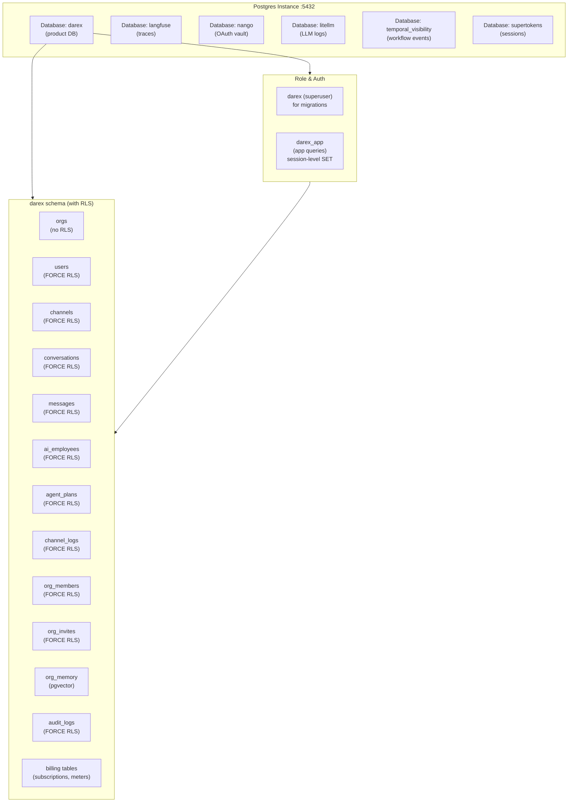
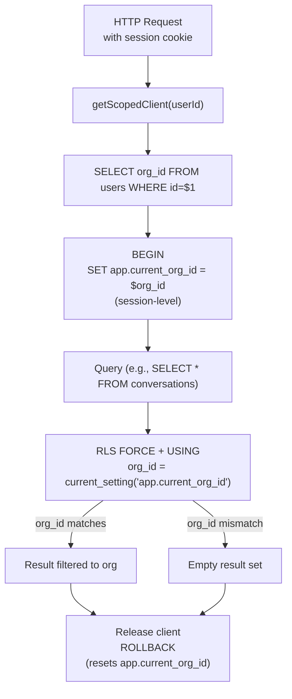

# 11 — Database and tenancy

Postgres 16 + pgvector. Database `darex` is the product DB. Sibling DBs on the
same instance: `langfuse`, `nango`, `litellm`, `temporal_visibility`,
`supertokens`.

Migrations: `infra/db/migrations/*.sql` via `pnpm db:migrate` (`infra/db/migrate.js`,
table `_migrations`).

## Database instance architecture



## RLS enforcement pattern



## Tables

| Table | RLS | Purpose |
|-------|-----|---------|
| `orgs` | **No** | Tenant root: name, slug, plan, status |
| `users` | Forced | `org_id`, `supertokens_id`, email, role, `password_hash` |
| `ai_employees` | Forced | persona JSONB, `tool_allowlist[]`, `graph_id`, status |
| `channels` | Forced | `channel_type`, `nango_connection_id`, `meta` JSONB, unique `(org_id, channel_type)` |
| `conversations` | Forced | employee, channel, `chatwoot_conv_id`, status, contact, metadata |
| `messages` | Forced | role, content, `tool_calls`, `chatwoot_msg_id` **text** |
| `org_onboarding` | Forced | Wizard state |
| `org_invites` | Forced | Invite tokens (migration 009) |
| `password_reset_tokens` | No FORCE RLS | Hashed reset tokens (009) |
| `idempotency_keys` | Forced | Used by Temporal activities |
| `channel_logs` | Forced | Connector / webhook / agent audit |
| `agent_plans` | Forced | Ask AI plan steps, draft, status, reasoning |

## Migrations

| # | File | Change |
|---|------|--------|
| 001 | `001_core_schema.sql` | Core tables + USING policies |
| 002 | `002_rls_test.sql` | `test_rls_isolation()` |
| 003 | `003_channel_logs.sql` | Audit table |
| 004 | `004_password_hash.sql` | `users.password_hash` |
| 005 | `005_channels_unique_org_type.sql` | Unique `(org_id, channel_type)` |
| 006 | `006_messages_chatwoot_msg_id_text.sql` | Meta `wamid.*` |
| 007 | `007_agent_plans.sql` | Plan-confirm-execute |
| 008 | `008_rls_with_check.sql` | `WITH CHECK` + `darex_app` grants |
| 009 | `009_auth_tenancy.sql` | Unique email, invites, reset tokens, auth helpers |
| 010 | `010_webhook_inbox.sql` | `orgs.meta`, per-org Chatwoot ids, webhook resolvers |
| 011 | `011_employees_app_role.sql` | `graph_id` default; `darex_app` CONNECT + table grants |

## RLS pattern (008)

```sql
USING (org_id = current_setting('app.current_org_id', true)::UUID)
WITH CHECK (org_id = current_setting('app.current_org_id', true)::UUID)
```

`getScopedClient()` / `getOrgScopedClient()` set `app.current_org_id` at
**session** level and reset on release. Pool `max: 10` — do not hold a client
across SSE.

Role `darex_app` exists (password in init SQL). Dashboard, worker, and
`tool-executor` default to `darex_app` with **session-level** `set_config`
(transaction-local GUCs were a bug: they vanished at autocommit). Migrations
still run as superuser `darex`.

## agent_plans columns

`id`, `org_id`, `user_id`, `thread_id` (default `ask-ai`), `summary`,
`steps` JSONB, `status` (pending/approved/…), `current_step`, `draft` JSONB,
`reasoning` JSONB, `feedback`, timestamps.

## What works

- Isolation function + live RLS (Phase 0/1 verified).
- WITH CHECK on tenant tables.
- Unique channel upsert.
- Meta message ids as text.

## What does not

- `pgvector` enabled, no embeddings tables/pipeline (Phase 6).
