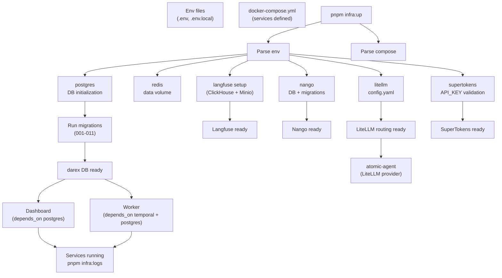

# 12 — Infrastructure (Docker)

File: `infra/docker-compose.yml`. Network `darex-net`. Boot: `pnpm infra:up`
from repo root (compose file under `infra/`).

Live compose has **19** services (older docs say 15).

## Docker compose service map

```mermaid
graph TB
  subgraph App["Application"]
    Dashboard["dashboard :3000<br/>(Next.js)"]
    Worker["worker<br/>(Temporal worker)"]
    Inbox["inbox :3004<br/>(Express proxy)"]
  end

  subgraph Core["Core Services"]
    Postgres["postgres :5432<br/>(Postgres 16 + pgvector)"]
    Temporal["temporal :7233<br/>(Workflow server)"]
    TemporalUI["temporal-ui :8233"]
    Redis["redis :6379<br/>(sessions)"]
  end

  subgraph Auth["Auth & Config"]
    ST["supertokens :3567"]
    Nango["nango-server :3003<br/>(OAuth vault)"]
  end

  subgraph Agent["Agent & Tools"]
    AtomicAgent["atomic-agent :8787<br/>(localhost only)"]
    Bridge["atomic-bridge :8790<br/>(localhost only)"]
    Sandbox["sandbox :8080<br/>(internal only)"]
  end

  subgraph LLM["LLM & Routing"]
    LiteLLM["litellm :4000<br/>→ OpenRouter"]
  end

  subgraph Observability["Observability"]
    Langfuse["langfuse-server :3002"]
    ClickHouse["langfuse-clickhouse :8123/9000<br/>(trace store)"]
    Minio["langfuse-minio :9090/9091<br/>(S3 blobs)"]
    LangfuseRedis["langfuse-redis<br/>(BullMQ)"]
    LangfuseWorker["langfuse-worker<br/>(async persist)"]
  end

  Dashboard --> Postgres
  Dashboard --> Redis
  Dashboard --> Temporal
  Dashboard --> ST
  Dashboard --> Nango
  Dashboard --> LiteLLM
  Dashboard --> Langfuse
  Dashboard --> Inbox

  Worker --> Temporal
  Worker --> AtomicAgent
  Worker --> Bridge
  Worker --> Postgres
  Worker --> Langfuse

  AtomicAgent --> LiteLLM
  Bridge --> Sandbox

  Temporal --> Postgres

  Langfuse --> ClickHouse
  Langfuse --> Minio
  Langfuse --> LangfuseRedis
  LangfuseWorker --> Langfuse
  LangfuseWorker --> ClickHouse
```

## Data flow: compose setup

## Services

| Service | Host port | Job | Health |
|---------|-----------|-----|--------|
| postgres | 5432 | Postgres 16 + pgvector | `pg_isready` |
| temporal | 7233 | Workflow server | `temporal workflow list` |
| temporal-ui | 8233 | UI | none |
| redis | 6379 | Nango queues | `PING` |
| langfuse-redis | internal | Langfuse BullMQ | `PING` |
| nango-server | 3003 | OAuth | `/health` |
| langfuse-clickhouse | 8123 / 9000 | Trace store | `SELECT 1` |
| langfuse-minio | 9090 / 9091 | S3 blobs | `mc ready` |
| langfuse-minio-createbuckets | — | One-shot buckets | exits |
| langfuse-server | 3002 | UI + API | `/api/public/health` |
| langfuse-worker | — | Async persist | none |
| supertokens | 3567 | Auth | TCP |
| litellm | 4000 | LLM gateway | `/health/readiness` |
| atomic-bridge | 127.0.0.1:8790 | MCP | TCP 8790 |
| atomic-agent | 127.0.0.1:8787 | Agent loop | TCP 8787 |
| sandbox | internal 8080 | Code exec | `/health` — context in working tree |
| inbox | 3004 | Chatwoot proxy | `/health` |
| worker | — | Temporal worker | no-op |
| dashboard | 3000 | Next.js `next start` | `GET /api/health` |

## LiteLLM (`infra/litellm/config.yaml`)

Alias `atomic-agent` → `openrouter/deepseek/deepseek-chat`. Fallbacks
`atomic-agent-fallback`, `atomic-agent-deepseek`. Langfuse callbacks on.
Classify/plan/revise set `reasoning: { enabled: false }`.

atomic-agent compose default provider: `darex-litellm`. Worker may still
reference `darex-openrouter` depending on env.

## Sandbox

`infra/docker/sandbox/` is in this working tree (`Dockerfile` + `server.mjs`,
unprivileged uid 10001). It is **untracked vs commit `99b5f04`**. Compose can
build it. `SANDBOX_API_URL=http://sandbox:8080` is wired on worker + dashboard.

## Custom skills

`infra/docker/atomic-agent/custom-skills/` has 11 SKILL.md playbooks.
Dockerfile COPY merges them into `starter-skills`. Rebuild the atomic-agent
image after playbook edits.

## Redis / Langfuse ops

Nango uses shared `redis`. Langfuse server/worker use dedicated
`langfuse-redis`. Ingestion schema is fixed; ClickHouse persistence can still
be flaky. Compose `env_file` entries are `required: false`.

## Verification scripts (`infra/scripts/`)

| Script | Last recorded |
|--------|----------------|
| `check-phase0.js` | 17/17 — foundation containers (not dashboard/worker/agent/sandbox) |
| `check-phase2.js` | 17/17 — 7 integrations |
| `check-phase3.js` | 6/6 — Chatwoot HMAC ingest |
| `check-auth-nango.js` | 3/3 |
| `e2e-live-llm.js` | 5/5 inbound+LLM; outbound Meta 401 |
| `seed-nango-configs.sql` | Gmail scopes + intercom/notion + drive/docs/sheets |

Host fallbacks: `worker-launcher.js`, `bridge-launcher.js` (merge env files).
Prefer compose `worker` / `atomic-bridge` now.

## Host vs Docker

Stack is meant to run **fully in compose**. Dashboard image compiles
`@darex/connectors` + `@darex/workflows`. Worker uses `TEMPORAL_ADDRESS=temporal:7233`,
`ATOMIC_AGENT_URL=http://atomic-agent:8787`, `NANGO_HOST=http://nango-server:3003`.

`pnpm dev` still runs Next on the host against those ports.
