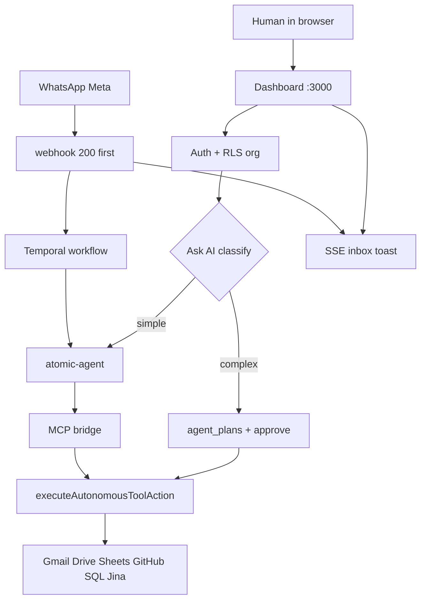

# 15 — How to run and verify

## Boot

```bash
pnpm install
pnpm infra:up          # docker compose -f infra/docker-compose.yml up -d
pnpm db:migrate        # infra/db/migrations/*.sql in order
pnpm dev               # dashboard only (host Next)
# or rely on compose `dashboard` on :3000
```

If sandbox has not been built yet, `pnpm infra:up` will build
`infra/docker/sandbox`. Run `pnpm db:migrate` so 009–011 apply.

## Useful URLs (local)

| URL | What |
|-----|------|
| http://localhost:3000 | Dashboard |
| http://localhost:3002 | Langfuse |
| http://localhost:3003 | Nango (set real OAuth client IDs here) |
| http://localhost:3004 | Inbox gateway health |
| http://localhost:4000 | LiteLLM |
| http://localhost:8233 | Temporal UI |
| http://127.0.0.1:8787 | atomic-agent (localhost only) |
| http://127.0.0.1:8790/sse | MCP bridge (localhost only) |

## Env (names only — values live in gitignored `.env*`)

Must be aligned across `infra/.env`, `apps/dashboard/.env.local`, compose
`environment` (compose **wins** over env_file; env_file is `required: false`).
Root `.env.example` lists names only.

- DB: `DB_HOST`, `DB_PORT`, `DB_USER` (runtime default `darex_app`), `DB_PASSWORD`, `DB_NAME`. Compose dashboard/worker: `APP_DB_USER` / `APP_DB_PASSWORD`. Migrations use superuser `darex`.
- Auth: `SUPERTOKENS_CONNECTION_URI`, `SUPERTOKENS_API_KEY`
- Nango: `NANGO_HOST`, `NANGO_SECRET_KEY` (UUID), `NEXT_PUBLIC_NANGO_PUBLIC_KEY`,
  `NEXT_PUBLIC_NANGO_HOST`
- LLM: `LITELLM_BASE_URL`, `LITELLM_MASTER_KEY`, `OPENROUTER_API_KEY`
- Agent: `ATOMIC_AGENT_URL`, `ATOMIC_AGENT_API_KEY`, `ATOMIC_AGENT_TIMEOUT_MS`
- Tools: `JINA_API_KEY`, `SANDBOX_API_URL`, `META_ACCESS_TOKEN`,
  `WHATSAPP_PHONE_NUMBER_ID`, `VERIFY_TOKEN`, `CHATWOOT_WEBHOOK_SECRET`
- Mail (optional): `RESEND_API_KEY`, `MAIL_FROM`
- Traces: `LANGFUSE_HOST`, `LANGFUSE_PUBLIC_KEY`, `LANGFUSE_SECRET_KEY`

`NANGO_SECRET_KEY` must be Nango’s **dev UUID**. A non-UUID string makes every
tool return `notConnected`.

After changing Gmail scopes, run `infra/scripts/seed-nango-configs.sql` and
`docker compose restart nango-server`, then **re-connect Gmail** in the browser.

## Manual happy path

1. Open `/register` → unique org.
2. `/connectors` → connect Gmail (and others that have real client IDs).
3. `/ask-ai` simple: “How many channels does this org have?”
4. `/ask-ai` complex: “Draft an email to X and make a Google Sheet of Y” →
   approve plan → watch SSE steps.
5. `/conversations` → leave EventSource open; POST a Chatwoot webhook with HMAC
   → amber toast.
6. Temporal UI should show `AutonomousAgentWorkflow` for WhatsApp / agent/run.

## Check scripts

```bash
node infra/scripts/check-phase0.js
node infra/scripts/check-phase2.js
node infra/scripts/check-phase3.js
node infra/scripts/check-auth-nango.js
# needs a valid META_ACCESS_TOKEN:
node infra/scripts/e2e-live-llm.js
```

## End-to-end map (one picture)



Read next: [16-updates-2026-08-13.md](./16-updates-2026-08-13.md), then
[00-status-at-a-glance.md](./00-status-at-a-glance.md) and
[14-what-does-not-work.md](./14-what-does-not-work.md).
